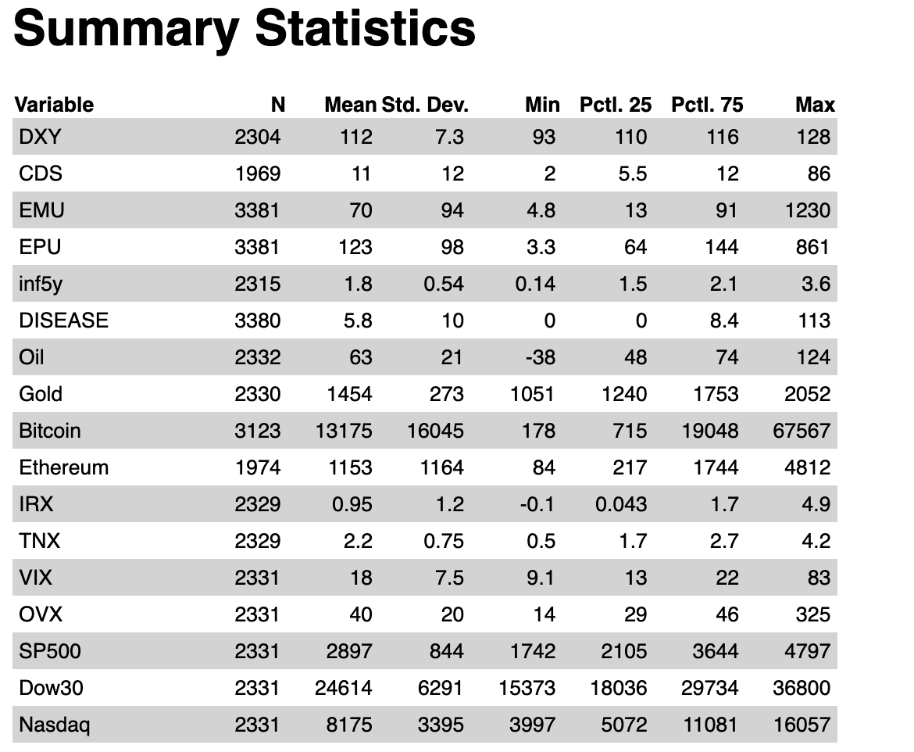

```{r setup, include=FALSE}
library('TTR')
library('quantmod')
library('knitr')
library('xts')
library('lubridate')
library('vtable')
library(tidyverse)
library(rpart)
library(rpart.plot)
library(ggplot2)
library(dplyr)
library(rsample)  
library(caret)
library(modelr)
library(randomForest)
library(gbm)
library(pdp)
library(scales)
library(kableExtra)
```

# Abstract

# Introduction

Bitcoin, a type of digital currency run on blockchain technology, has recently gained traction as a potential currency to substitute for fiat money such as the U.S. dollar. A massive ‘money-printing’ by the Federal Reserve in response to the 2008 financial crisis and the Covid crisis has raised concerns about the strength and sustainability of the dollar value. Since then, market participants have been increasingly treating Bitcoin as a hedging asset. Devoid of the intrinsic value, however, Bitcoin has experienced a massive fluctuation in terms of asset prices. Specifically, at the onset of the Covid crisis in March 2020, the Bitcoin price dipped as low as `$5,165`. It grew more than tenfold to `$61,283` per Bitcoin in exactly one year, and hit as high as `$64,400` before crashing back down to hovering around `$25,000` in the beginning of the year 2023. Therefore, investors have taken interest in predicting the short-term Bitcoin price. → (too many have pp’s)

This report answers 3 questions. First, we attempt to test a variety of models and find a model that best predicts the Bitcoin price direction. We intend to look at the time horizons of 5-day, 10-day, and 20-day, representing 1 week, 2 weeks, and 4 weeks excluding weekends, respectively. Note that our report focuses on predicting the Bitcoin price direction, rather than the magnitude of the price. Predicting the size of the prices requires an exorbitant amount of computing power, and models often perform poorly. In other words, it is not cost-effective, nor efficient. We will show how accurate our model performs by comparing our model prediction and the realized price direction. 

Second, after identifying the best-predicting model, we attempt to find a variable that contributes the most to the price direction prediction. Next, we plan to run the model not only on Bitcoin but also on two other popular coins in terms of trading volumes, Ethereum, and Ripple, using common features. In doing so, we are able to find if these coins are ‘substitutes’ or ‘complements’ to one another. This finding can help investors make well-informed investment decisions; they may be able to diversify their digital asset portfolios in response to technical or macroeconomic shocks using our model. 

# Methods

## Data:

After reading a few existing studies regarding price prediction of an investment asset, we have learned that a wide spectrum of macroeconomic and market performance factors, such as inflation, interest rates, and market volatility are incorporated in building price predicting models. In addition to these common factors, we have also added some other variables we deemed important in terms of predictive power. Our data set consists of relevant daily asset prices, macroeconomic and market performance indicators, which are mainly collected from Yahoo Finance and Federal Reserve Economic Data (FRED).

First, we have daily prices of Bitcoin (BTC), Ethereum (ETH), oil, and gold. Inflation is measured by two proxies, yield on 10-year Treasury note (TNX) and 13 Week Treasury Bill (IRX). CBOE volatility index (VIX) estimates equity market volatility, while CBOE crude oil volatility index (OVX) measures oil market uncertainty. SP500, which tracks the top 500 U.S. stocks, is used to compute the US stock market performance. All of these data were collected from Yahoo Finance.

In addition to aforementioned inflation proxies, 5-Year breakeven inflation rate (inf5y), which implies market participants’ inflation expectation for the next five years, was also added. Equity Market Volatility: Infectious Disease Tracker (DISEASE) was included to account for the economic impact of COVID-19. U.S. dollar index (DXY) measures the performance of dollar against a basket of other world currencies. Policy-related uncertainty is measured by Economic Policy Uncertainty Index (EPU), and stock market uncertainty is measured by Equity Market Uncertainty Index (EMU). All of these data were collected from FRED. 

Lastly, we added Credit Default Swap (CDS), which basically is a financial derivative through which a seller can swap his credit risk with that of a buyer. As this indicator measures dwindling of centralized financial markets, we thought it would be interesting to see its relationship with the price action of cryptocurrencies, a decentralized asset class. This data was separately collected from Investing.com.


## Methodology:

In predicting Bitcoin price direction, we compare three main models: Classification and Regression Trees (CART), Random Forest and Gradient Boosting. To briefly recap what we learned in class, tree is a simple predictive model that is widely used in machine learning. CART, also called “recursive partitioning”, is a basic tree-fitting algorithm. Basically, we grow the tree recursively as to make deviance as small as possible. When we reach our minimum size or complexity stopping points, we will stop growing and prune back to make candidate trees. Lastly, we will choose via cross validation (min or 1SE).
 
Random forest is perhaps the most popular generic nonparametric regression technique as the model not only requires little to no cross validation and is also fast and effective. Here, we will fit trees to number of bootstrapped samples of the original data. This process, also called bagging, usually produces a better fit with lower variance than a single tree. It adds more randomness as we ‘randomly’ choose features subsets in building a tree, hence the name ‘random forest.’ After fitting a tree to each bootstrapped sample, we will average the predictions of all the different trees, producing an aggregated result, which should be more accurate.
 
Gradient boosting is an ensemble method like random forests. However, here you recursively fit simple trees to its ‘residuals’. That is, while random forests fits trees simultaneously, gradient boosting builds one tree at a time. This model adds the newly crushed tree into the fit in each stage along the way and so the final fit is the sum of many trees. Gradient boosting can work better than random forests with finely-tuned parameters. However, it is more sensitive to noise, thus more easily encounters over-fitting problems.

\newline
\newline

```{r sumstat,message=FALSE, echo=FALSE, warning=FALSE}


```

\newline
\newline

# Results

```{r get_yahoo_data,message=FALSE, echo=FALSE, warning=FALSE}

df_oil <- getSymbols('CL=F',src='yahoo',auto.assign=FALSE)
#class(df_oil)
#nrow(df_oil) #4103
#head(df_oil,2) # 2007-01-03
#tail(df_oil,2) # 2023-04-04

df_gold <- getSymbols('GC=F',src='yahoo',auto.assign=FALSE)
#class(df_gold)
#nrow(df_gold) #4103
#head(df_gold,2) # 2007-01-03
#tail(df_gold,2) # 2023-04-04

df_bitcoin <- getSymbols('BTC-USD',src='yahoo',auto.assign=FALSE)
#class(df_bitcoin)
#nrow(df_bitcoin) #3123
#head(df_bitcoin,2) # 2014-09-17
#tail(df_bitcoin,2) # 2023-04-05

df_ether <- getSymbols('ETH-USD',src='yahoo',auto.assign=FALSE)
#class(df_ether)
#nrow(df_ether) #1980
#head(df_ether,2) # 2017-11-09
#tail(df_ether,2) # 2023-04-11

#df_ripple <- getSymbols('XRP-USD',src='yahoo',auto.assign=FALSE)
#class(df_ripple)
#nrow(df_ripple) #1980
#head(df_ripple,2) # 2017-11-09
#tail(df_ripple,2) # 2023-04-11

df_irx <- getSymbols('^IRX',src='yahoo',auto.assign=FALSE)
#class(df_irx)
#nrow(df_irx) #4950
#head(df_irx,2) # 2007-01-03
#tail(df_irx,2) # 2023-04-04

df_tnx <- getSymbols('^TNX',src='yahoo',auto.assign=FALSE)
#class(df_tnx)
#nrow(df_tnx) #4950
#head(df_tnx,2) # 2007-01-03
#tail(df_tnx,2) # 2023-04-04

df_vix <- getSymbols('^VIX',src='yahoo',auto.assign=FALSE)
#class(df_vix)
#nrow(df_vix) #4092
#head(df_vix,2) # 2007-01-03
#tail(df_vix,2) # 2023-04-04

df_ovx <- getSymbols('^OVX',src='yahoo',auto.assign=FALSE)
#class(df_ovx)
#nrow(df_ovx) #4004
#head(df_ovx,2) # 2007-05-01
#tail(df_ovx,2) # 2023-04-04

df_sp500 <- getSymbols('^GSPC',src='yahoo',auto.assign=FALSE)
#class(df_sp500)
#nrow(df_sp500) #4103
#head(df_sp500,2) # 2007-01-03
#tail(df_sp500,2) # 2023-04-04

df_dow30 <- getSymbols('^DJI',src='yahoo',auto.assign=FALSE)
#class(df_dow30)
#nrow(df_dow30) #4095
#head(df_dow30,2) # 2007-01-03
#tail(df_dow30,2) # 2023-04-04

df_nasdaq <- getSymbols('^IXIC',src='yahoo',auto.assign=FALSE)
#class(df_nasdaq)
#nrow(df_nasdaq) #4095
#head(df_nasdaq,2) # 2007-01-03
#tail(df_nasdaq,2) # 2023-04-04
```


```{r get_fred_data,message=FALSE, echo=FALSE, warning=FALSE}

df_dxy <- read.csv('Data/DXY.csv') # Nominal Broad U.S. Dollar Index
# https://fred.stlouisfed.org/series/DTWEXBGS
#nrow(df_dxy) #2417
#head(df_dxy) #2014-01-01
#tail(df_dxy) #2023-04-04

df_cds <- read.csv('Data/1YCDS.csv') # United States CDS 1 Year USD
#https://www.investing.com/rates-bonds/united-states-cds-1-year-usd-historical-data
#nrow(df_cds) #1969
#head(df_cds) #2014-01-01
#tail(df_cds) #2023-04-04
df_cds=df_cds[1:2]
colnames(df_cds)[1] ="DATE"
df_cds$DATE <- as.Date(df_cds$DATE, "%m/%d/%Y")
df_cds$DATE <- format(df_cds$DATE, "%Y-%m-%d")

df_emu <- read.csv('Data/EMU.csv') # Equity Market-related Economic Uncertainty Index 
# https://fred.stlouisfed.org/series/WLEMUINDXD
#nrow(df_emu) #3381
#head(df_emu) #2014-01-01
#tail(df_emu) #2023-04-04

df_epu <- read.csv('Data/EPU.csv') # Economic Policy Uncertainty Index for United States
#https://fred.stlouisfed.org/series/USEPUINDXD
#nrow(df_epu) #3381
#head(df_epu) #2014-01-01
#tail(df_epu) #2023-04-04

df_inf5y <- read.csv('Data/5YIE.csv') # 5-Year Breakeven Inflation Rate
#https://fred.stlouisfed.org/series/T5YIE
#nrow(df_inf5y) #2414
#head(df_inf5y) #2014-01-01
#tail(df_inf5y) #2023-04-04

df_disease <- read.csv('Data/DISEASE.csv') # Equity Market Volatility: Infectious Disease Tracker
# https://fred.stlouisfed.org/series/INFECTDISEMVTRACKD
#nrow(df_disease) #3381
#head(df_disease) #2014-01-01
#tail(df_disease) #2023-04-04

```


```{r merge_fred_data, message=FALSE, echo=FALSE, warning=FALSE, include=FALSE}
# change "chracter" date type to "date" date type
colnames(df_dxy)[1] ="DATE"
df_dxy$DATE <- ymd(df_dxy$DATE)
colnames(df_cds)[1] ="DATE"
df_cds$DATE <- ymd(df_cds$DATE)
colnames(df_emu)[1] ="DATE"
df_emu$DATE <- ymd(df_emu$DATE)
colnames(df_epu)[1] ="DATE"
df_epu$DATE <- ymd(df_epu$DATE)
colnames(df_inf5y)[1] ="DATE"
df_inf5y$DATE <- ymd(df_inf5y$DATE)
colnames(df_disease)[1] ="DATE"
df_disease$DATE <- ymd(df_disease$DATE)

colnames(df_dxy)[2] ="DXY"
colnames(df_cds)[2] ="CDS"
colnames(df_emu)[2] ="EMU"
colnames(df_epu)[2] ="EPU"
colnames(df_inf5y)[2] ="inf5y"
colnames(df_disease)[2] ="DISEASE"

fred_0 <- merge(x=df_dxy, y=df_cds, by="DATE",all=TRUE)
fred_1 <- merge(x=df_emu, y=df_epu, by="DATE",all=TRUE)
fred_2 <- merge(x=df_inf5y, y=df_disease, by="DATE",all=TRUE)
fred_m <- merge(x=fred_0, y=fred_1, by="DATE",all=TRUE)
fred_data <- merge(x=fred_m, y=fred_2, by="DATE", all=TRUE)

# here, df_inf5y have some missing data
nrow(fred_data) #3384

# we can see some columns are character
sapply(fred_data, class)

# change character to numeric 
fred_data$DXY = as.numeric(as.character(fred_data$DXY)) 
fred_data$'inf5y' = as.numeric(as.character(fred_data$'inf5y')) 
fred_data$DISEASE = as.numeric(as.character(fred_data$DISEASE)) 

# all numeric
sapply(fred_data, class)


```


```{r merge_yahoo_data, message=FALSE, echo=FALSE, warning=FALSE, include=FALSE}

nrow(df_oil) #4103
nrow(df_gold) #4103
nrow(df_bitcoin) #3123
nrow(df_ether) #1980
#nrow(df_ripple) #1980
nrow(df_irx) #4950
nrow(df_tnx) #4950
nrow(df_vix) #4092
nrow(df_ovx) #4004
nrow(df_sp500) #4095
nrow(df_dow30) #4095
nrow(df_nasdaq) #4095

yahoo <- merge (df_oil,df_gold,df_bitcoin,df_ether,df_irx,df_tnx,df_vix,df_ovx,df_sp500,df_dow30,df_nasdaq)

# data has 2007-01-02 to 2023-04-05
head(yahoo)
tail(yahoo)

nrow(yahoo) #5480

# select data 2014-01-02 to 2023-04-05
yahoo_sliced_data = yahoo[2131:5468]

# all column is xts type 
sapply(yahoo_sliced_data, class)

# convert xts object to data.frame
data(yahoo_sliced_data)
x <- as.xts(yahoo_sliced_data, dateFormat="DATE")
yahoo_data <- fortify.zoo(x)
head(yahoo_data)
str(yahoo_data)

# change "Index" to "DATE"
colnames(yahoo_data)[1] ="DATE"
head(yahoo_data)

# check
str(yahoo_data)
sapply(yahoo_data, class)

# select only 'adjusted' data, dropping open/high/low/close/volume
cleaned_yahoo <- yahoo_data %>%
  select(DATE, CL.F.Adjusted, GC.F.Adjusted, BTC.USD.Adjusted, ETH.USD.Adjusted, IRX.Adjusted, TNX.Adjusted, VIX.Adjusted, OVX.Adjusted, GSPC.Adjusted, DJI.Adjusted, IXIC.Adjusted, )

colnames(cleaned_yahoo)

```

```{r merge_two_data, message=FALSE, echo=FALSE, warning=FALSE, include=FALSE}

df <- merge(x=fred_data, y=cleaned_yahoo, by="DATE", all=TRUE)

# main dataset, containing everything including bitcoin and ether and all it's from 2014-01-01 to 2023-04-07
head(df)
tail(df)
colnames(df)
str(df)
nrow(df) #3384

df <- df %>%rename(Bitcoin = BTC.USD.Adjusted, Ethereum = ETH.USD.Adjusted, Oil=CL.F.Adjusted, Gold=GC.F.Adjusted, IRX=IRX.Adjusted, TNX=TNX.Adjusted, VIX=VIX.Adjusted, OVX=OVX.Adjusted, SP500=GSPC.Adjusted, Dow30=DJI.Adjusted, Nasdaq=IXIC.Adjusted)

```


## Bitcoin 

### Classification and Regression Trees (CART)
```{r bitcoin_CART, message=FALSE, echo=FALSE, warning=FALSE}

bitcoin <- df %>%
  select(DATE, Bitcoin, Oil, Gold, IRX, TNX, VIX, OVX, SP500, Dow30, Nasdaq, DXY, CDS, EMU, EPU, inf5y, DISEASE)

# drop na value. Main data set is from 2014-01-01 and bitcoin data is from 2014-09-17. Also weekend data will be dropped
bitcoin <- na.omit(bitcoin) 

# reset index
rownames(bitcoin) <- NULL

# this solves error(Error in eval(expr, envir, enclos) : object '' not found)
names(bitcoin) <- make.names(names(bitcoin))

nrow(bitcoin) #1723

bitcoin_without_date <- bitcoin %>%
  select(Bitcoin, Oil, Gold, IRX, TNX, VIX, OVX, SP500, Dow30, Nasdaq, DXY, CDS, EMU, EPU, inf5y, DISEASE)

# this solves error(Error in eval(expr, envir, enclos) : object '' not found)
names(bitcoin_without_date) <- make.names(names(bitcoin_without_date))

# split training and testing set
bitcoin_split = initial_split(bitcoin_without_date, prop = 0.8)
bitcoin_train = training(bitcoin_split)
bitcoin_test = testing(bitcoin_split)

bitcoin_CART=rpart(Bitcoin ~ ., data=bitcoin_train, control=rpart.control(cp=0.002,minsplit=30))

rpart.plot(bitcoin_CART, digits=-5, type=4, extra=1)


```


```{r bitcoin_CART.1, message=FALSE, echo=FALSE, warning=FALSE}
# check the rmse
rmse_bitcoin_CART=rmse(bitcoin_CART,bitcoin_test)

# print the rmse
rmse_bitcoin_CART
```


### Random Forest
```{r bitcoin_RF, , message=FALSE, echo=FALSE, warning=FALSE}

bitcoin_RF=randomForest(Bitcoin ~ ., data=bitcoin_train,  important=TRUE)

varImpPlot(bitcoin_RF)

```


```{r  bitcoin_RF.1, message=FALSE, echo=FALSE, warning=FALSE}
# check the rmse
rmse_RF=rmse(bitcoin_RF,bitcoin_test)

# print the rmse
rmse_RF
```


```{r RF_dependence_plot1, message=FALSE, echo=FALSE, warning=FALSE}

partialPlot(bitcoin_RF, bitcoin_test, 'SP500', las=1)

```


```{r RF_dependence_plot2, message=FALSE, echo=FALSE, warning=FALSE}

partialPlot(bitcoin_RF, bitcoin_test, 'Nasdaq', las=1)

```


```{r RF_dependence_plot3, message=FALSE, echo=FALSE, warning=FALSE}

partialPlot(bitcoin_RF, bitcoin_test, 'inf5y', las=1)

```

### Gradient Boosting

``` {r bitcoin_gradient, message=FALSE, echo=FALSE, warning=FALSE}
# fit a tree for gradient boosted trees
bitcoin_boost= gbm(Bitcoin ~ . ,distribution='gaussian', data=bitcoin_train,interaction.depth=4, n.trees=500, shrinkage=.05, cv.folds = 8)
  
# plot for gradient boosting 
plot(bitcoin_boost)
# Look at error curve -- stops decreasing much after ~300
gbm.perf(bitcoin_boost)

```

``` {r bitcoin_gradient.1, message=FALSE, echo=FALSE, warning=FALSE}

# check the rmse
rmse_Boost=rmse(bitcoin_boost,bitcoin_test)
# print the rmse
rmse_Boost

```

```{r RMSE_table, message=FALSE, echo=FALSE, warning=FALSE}
first_col= c("CART","Random Forest","Gradient Boosting")
second_col= c(rmse_bitcoin_CART,rmse_RF, rmse_Boost)
df_rmse_ = data.frame(first_col, second_col)
knitr::kable(df_rmse_,col.names = c("Model","RMSE"))
```

\newline
\newline
\newline
\newline


## Ethereum

### Classification and Regression Trees (CART)
```{r ethereum_CART, message=FALSE, echo=FALSE, warning=FALSE}

ethereum <- df %>%
  select(DATE, Ethereum, Oil, Gold, IRX, TNX, VIX, OVX, SP500, Dow30, Nasdaq, DXY, CDS, EMU, EPU, inf5y, DISEASE)

# drop na value. Main data set is from 2014-01-01 and ethereum data is from 2017-11-09. Also weekend data will be dropped
ethereum <- na.omit(ethereum) 

# reset index
rownames(ethereum) <- NULL

# this solves error(Error in eval(expr, envir, enclos) : object '' not found)
names(ethereum) <- make.names(names(ethereum))

nrow(ethereum) #1023

ethereum_without_date <- ethereum %>%
  select(Ethereum, Oil, Gold, IRX, TNX, VIX, OVX, SP500, Dow30, Nasdaq, DXY, CDS, EMU, EPU, inf5y, DISEASE)

# this solves error(Error in eval(expr, envir, enclos) : object '' not found)
names(ethereum_without_date) <- make.names(names(ethereum_without_date))

# split training and testing set
ethereum_split = initial_split(ethereum_without_date, prop = 0.8)
ethereum_train = training(ethereum_split)
ethereum_test = testing(ethereum_split)

ethereum_CART=rpart(Ethereum ~ ., data=ethereum_train, control=rpart.control(cp=0.002,minsplit=30))

rpart.plot(ethereum_CART, digits=-5, type=4, extra=1)


```


```{r ethereum_CART.1, message=FALSE, echo=FALSE, warning=FALSE}
# check the rmse
rmse_ethereum_CART=rmse(ethereum_CART,ethereum_test)

# print the rmse
rmse_ethereum_CART
```


### Random Forest
```{r ethereum_RF, , message=FALSE, echo=FALSE, warning=FALSE}

ethereum_RF=randomForest(Ethereum ~ ., data=ethereum_train,  important=TRUE)

varImpPlot(ethereum_RF)

```


```{r  ethereum_RF.1, message=FALSE, echo=FALSE, warning=FALSE}
# check the rmse
rmse_ether_RF=rmse(ethereum_RF,ethereum_test)

# print the rmse
rmse_ether_RF
```


```{r ether_RF_dependence_plot1, message=FALSE, echo=FALSE, warning=FALSE}

partialPlot(ethereum_RF, ethereum_test, 'SP500', las=1)

```


```{r ether_RF_dependence_plot2, message=FALSE, echo=FALSE, warning=FALSE}

partialPlot(ethereum_RF, ethereum_test, 'Dow30', las=1)

```


```{r ether_RF_dependence_plot3, message=FALSE, echo=FALSE, warning=FALSE}

partialPlot(ethereum_RF, ethereum_test, 'inf5y', las=1)

```

### Gradient Boosting

``` {r ethereum_gradient, message=FALSE, echo=FALSE, warning=FALSE}
# fit a tree for gradient boosted trees
ethereum_boost= gbm(Ethereum ~ . ,distribution='gaussian', data=ethereum_train,interaction.depth=4, n.trees=500, shrinkage=.05, cv.folds = 8)
  
# plot for gradient boosting 
plot(ethereum_boost)
# Look at error curve -- stops decreasing much after ~300
gbm.perf(ethereum_boost)

```

``` {r ethereum_gradient.1, message=FALSE, echo=FALSE, warning=FALSE}

# check the rmse
rmse_ether_Boost=rmse(ethereum_boost,ethereum_test)
# print the rmse
rmse_ether_Boost

```

```{r ether_RMSE_table, message=FALSE, echo=FALSE, warning=FALSE}
first_col= c("CART","Random Forest","Gradient Boosting")
second_col= c(rmse_ethereum_CART, rmse_ether_RF, rmse_ether_Boost)
df_ether_ = data.frame(first_col, second_col)
knitr::kable(df_ether_,col.names = c("Model","RMSE"))
```

\newline
\newline
\newline
\newline


# Conclusion


# Appendix
```{r timeseries_tables, message=FALSE, echo=FALSE, warning=FALSE}

chartSeries(df_oil,name="Crude Oil",theme = 'white',subset='2014::2023')
chartSeries(df_gold,name="Gold",theme = 'white',subset='2014::2023')
chartSeries(df_bitcoin,name="Bitcoin",theme = 'white',subset='2014::2023')
chartSeries(df_ether,name="Ethereum",theme = 'white',subset='2017::2023')
#chartSeries(df_ripple,name="Ripple(XRP)",theme = 'white',subset='2017::2023')
plot(df_irx, main = '13 Week Treasury Bill')
plot(df_tnx, main = 'Treasury Yield 10 Years')
plot(df_vix, main="CBOE Volatility Index")
plot(df_ovx,name="CBOE Crude Oil Volatility Index")
chartSeries(df_sp500,name="S&P 500",theme = 'white',subset='2014::2023')
chartSeries(df_dow30,name="Dow 30",theme = 'white',subset='2014::2023')
chartSeries(df_nasdaq,name="Nasdaq",theme = 'white',subset='2014::2023')

```