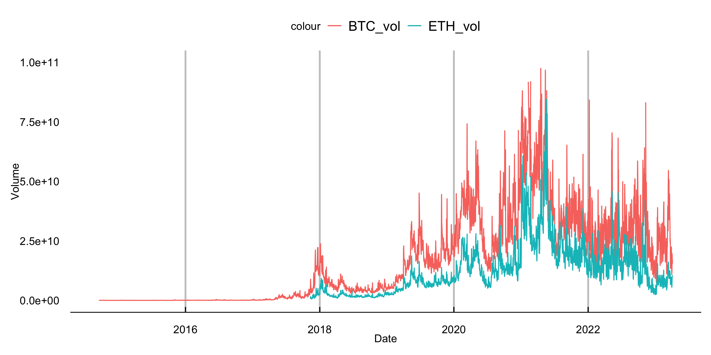
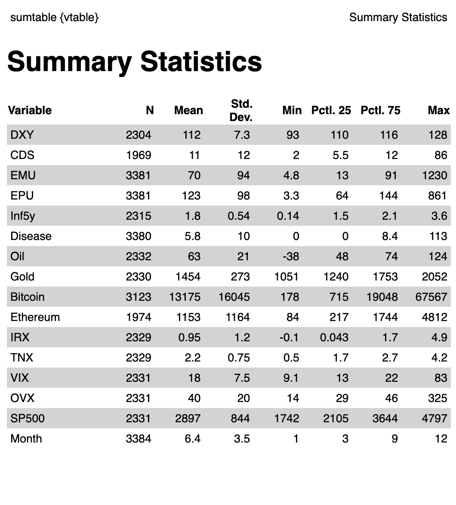

```{r setup, include=FALSE}
library('TTR')
library('quantmod')
library('knitr')
library('xts')
library('lubridate')
library('vtable')
library('gridExtra')
library('kableExtra')
library('grid')
library('pdp')
library('lattice')
library('tidyr')
library('ggthemes')
library('scales')
library(corrplot)
library(ggplot2)
library(foreach)
library(tidyverse)
library(rpart)
library(rpart.plot)
library(dplyr)
library(rsample)  
library(caret)
library(modelr)
library(randomForest)
library(gbm)
library(pdp)
library(scales)
```

```{r get_yahoo_data,message=FALSE, echo=FALSE, warning=FALSE}

df_oil <- getSymbols('CL=F',src='yahoo',auto.assign=FALSE)
#nrow(df_oil) #4103
#head(df_oil,2) # 2007-01-03
#tail(df_oil,2) # 2023-04-04

df_gold <- getSymbols('GC=F',src='yahoo',auto.assign=FALSE)
#nrow(df_gold) #4103
#head(df_gold,2) # 2007-01-03
#tail(df_gold,2) # 2023-04-04

df_bitcoin <- getSymbols('BTC-USD',src='yahoo',auto.assign=FALSE)
#nrow(df_bitcoin) #3123
#head(df_bitcoin,2) # 2014-09-17
#tail(df_bitcoin,2) # 2023-04-05

df_ether <- getSymbols('ETH-USD',src='yahoo',auto.assign=FALSE)
#nrow(df_ether) #1980
#head(df_ether,2) # 2017-11-09
#tail(df_ether,2) # 2023-04-11

df_irx <- getSymbols('^IRX',src='yahoo',auto.assign=FALSE)
#nrow(df_irx) #4950
#head(df_irx,2) # 2007-01-03
#tail(df_irx,2) # 2023-04-04

df_tnx <- getSymbols('^TNX',src='yahoo',auto.assign=FALSE)
#nrow(df_tnx) #4950
#head(df_tnx,2) # 2007-01-03
#tail(df_tnx,2) # 2023-04-04

df_vix <- getSymbols('^VIX',src='yahoo',auto.assign=FALSE)
#nrow(df_vix) #4092
#head(df_vix,2) # 2007-01-03
#tail(df_vix,2) # 2023-04-04

df_ovx <- getSymbols('^OVX',src='yahoo',auto.assign=FALSE)
#nrow(df_ovx) #4004
#head(df_ovx,2) # 2007-05-01
#tail(df_ovx,2) # 2023-04-04

df_sp500 <- getSymbols('^GSPC',src='yahoo',auto.assign=FALSE)
#nrow(df_sp500) #4103
#head(df_sp500,2) # 2007-01-03
#tail(df_sp500,2) # 2023-04-04

```

```{r get_fred_data,message=FALSE, echo=FALSE, warning=FALSE}

df_dxy <- read.csv('Data/DXY.csv') # Nominal Broad U.S. Dollar Index
#nrow(df_dxy) #2417
#head(df_dxy) #2014-01-01
#tail(df_dxy) #2023-04-04

df_emu <- read.csv('Data/EMU.csv') # Equity Market-related Economic Uncertainty Index 
#nrow(df_emu) #3381
#head(df_emu) #2014-01-01
#tail(df_emu) #2023-04-04

df_epu <- read.csv('Data/EPU.csv') # Economic Policy Uncertainty Index for United States
#nrow(df_epu) #3381
#head(df_epu) #2014-01-01
#tail(df_epu) #2023-04-04

df_inf5y <- read.csv('Data/5YIE.csv') # 5-Year Breakeven Inflation Rate
#nrow(df_inf5y) #2414
#head(df_inf5y) #2014-01-01
#tail(df_inf5y) #2023-04-04

df_disease <- read.csv('Data/DISEASE.csv') # Equity Market Volatility: Infectious Disease Tracker
#nrow(df_disease) #3381
#head(df_disease) #2014-01-01
#tail(df_disease) #2023-04-04

df_cds <- read.csv('Data/1YCDS.csv') # United States CDS 1 Year USD
#nrow(df_cds) #1969
#head(df_cds) #2014-01-01
#tail(df_cds) #2023-04-04
df_cds=df_cds[1:2]
colnames(df_cds)[1] ="DATE"
df_cds$DATE <- as.Date(df_cds$DATE, "%m/%d/%Y")
df_cds$DATE <- format(df_cds$DATE, "%Y-%m-%d")

```

```{r merge_fred_data, message=FALSE, echo=FALSE, warning=FALSE, include=FALSE}
# change "chracter" date type to "date" date type
colnames(df_dxy)[1] ="DATE"
df_dxy$DATE <- ymd(df_dxy$DATE)
colnames(df_cds)[1] ="DATE"
df_cds$DATE <- ymd(df_cds$DATE)
colnames(df_emu)[1] ="DATE"
df_emu$DATE <- ymd(df_emu$DATE)
colnames(df_epu)[1] ="DATE"
df_epu$DATE <- ymd(df_epu$DATE)
colnames(df_inf5y)[1] ="DATE"
df_inf5y$DATE <- ymd(df_inf5y$DATE)
colnames(df_disease)[1] ="DATE"
df_disease$DATE <- ymd(df_disease$DATE)

colnames(df_dxy)[2] ="DXY"
colnames(df_cds)[2] ="CDS"
colnames(df_emu)[2] ="EMU"
colnames(df_epu)[2] ="EPU"
colnames(df_inf5y)[2] ="Inf5y"
colnames(df_disease)[2] ="Disease"

fred_0 <- merge(x=df_dxy, y=df_cds, by="DATE",all=TRUE)
fred_1 <- merge(x=df_emu, y=df_epu, by="DATE",all=TRUE)
fred_2 <- merge(x=df_inf5y, y=df_disease, by="DATE",all=TRUE)
fred_m <- merge(x=fred_0, y=fred_1, by="DATE",all=TRUE)
fred_data <- merge(x=fred_m, y=fred_2, by="DATE", all=TRUE)

# here, df_inf5y have some missing data
nrow(fred_data) #3384

# we can see some columns are character
sapply(fred_data, class)

# change character to numeric 
fred_data$DXY = as.numeric(as.character(fred_data$DXY)) 
fred_data$Inf5y = as.numeric(as.character(fred_data$Inf5y)) 
fred_data$Disease = as.numeric(as.character(fred_data$Disease)) 

# all numeric
sapply(fred_data, class)


```

```{r merge_yahoo_data, message=FALSE, echo=FALSE, warning=FALSE, include=FALSE}

# merge data
yahoo <- merge (df_oil,df_gold,df_bitcoin,df_ether,df_irx,df_tnx,df_vix,df_ovx,df_sp500)

# data has 2007-01-02 to 2023-04-05
head(yahoo)
tail(yahoo)

nrow(yahoo) #5481

# select data 2014-01-02 to 2023-04-05
yahoo_sliced_data = yahoo[2131:5468]

# all column is xts type 
sapply(yahoo_sliced_data, class)

# convert xts object to data.frame
data(yahoo_sliced_data)
x <- as.xts(yahoo_sliced_data, dateFormat="DATE")
yahoo_data <- fortify.zoo(x)
head(yahoo_data)
str(yahoo_data)

# change "Index" to "DATE"
colnames(yahoo_data)[1] ="DATE"
head(yahoo_data)

# check
str(yahoo_data)
sapply(yahoo_data, class)

# select only 'adjusted' data, dropping open/high/low/close/volume
cleaned_yahoo <- yahoo_data %>%
  select(DATE, CL.F.Adjusted, GC.F.Adjusted, BTC.USD.Adjusted, ETH.USD.Adjusted, IRX.Adjusted, TNX.Adjusted, VIX.Adjusted, OVX.Adjusted, GSPC.Adjusted)

colnames(cleaned_yahoo)
class(cleaned_yahoo$DATE)
```

```{r merge_two_data, message=FALSE, echo=FALSE, warning=FALSE, include=FALSE}

df <- merge(x=fred_data, y=cleaned_yahoo, by="DATE", all=TRUE)

# main dataset, containing everything including bitcoin and ether and all it's from 2014-01-01 to 2023-04-07
head(df)
tail(df)
colnames(df)
str(df)
nrow(df) #3384

df <- df %>%rename(Bitcoin = BTC.USD.Adjusted, Ethereum = ETH.USD.Adjusted, Oil=CL.F.Adjusted, Gold=GC.F.Adjusted, IRX=IRX.Adjusted, TNX=TNX.Adjusted, VIX=VIX.Adjusted, OVX=OVX.Adjusted, SP500=GSPC.Adjusted)

# adding 'Month' column from 'DATE' column
df$Month <- format(df$DATE, "%m")

# this month column is character class
# change character to numeric 
df$Month = as.numeric(as.character(df$Month)) 
```

```{r timeseries_tables, message=FALSE, echo=FALSE, warning=FALSE, include=FALSE}

chartSeries(df_oil,name="Crude Oil",theme = 'white',subset='2014::2023')
chartSeries(df_gold,name="Gold",theme = 'white',subset='2014::2023')
chartSeries(df_bitcoin,name="Bitcoin",theme = 'white',subset='2014::2023')
chartSeries(df_ether,name="Ethereum",theme = 'white',subset='2017::2023')
plot(df_irx, main = '13 Week Treasury Bill')
plot(df_tnx, main = 'Treasury Yield 10 Years')
plot(df_vix, main="CBOE Volatility Index")
plot(df_ovx,name="CBOE Crude Oil Volatility Index")
chartSeries(df_sp500,name="S&P 500",theme = 'white',subset='2014::2023')
```

```{r sumstat,message=FALSE, echo=FALSE, warning=FALSE, include=FALSE}
# making sumtable with sumtable()
sumtable(df)

```

# Abstract

Due to the wild volatility of cryptocurrency, many investors and experts have tried to make accurate price prediction for the asset class. Likewise in this project, we attempt to build the best price predictive model for Bitcoin and Ethereum and identify the most crucial variables that contribute to their prices. Among CART, random forests and Gradient boosting, we find that random forest model is the best price predictor for both assets. Next, we compare and contrast the most important features, analyzed via variable importance plots and partial dependence plots. For both assets, S&P500 and 5-year inflation expectation are the biggest features contributing to their prices. Where they differ is the third most important variable, which is gold price for Bitcoin and oil price for Ethereum, respectively. Utilizing these results, investors can make smart investment choices based on macroeconomic factors and market performance.


# Introduction

Bitcoin, the first digital currency run on blockchain technology, has recently gained traction as a potential currency to substitute for fiat money such as the U.S. dollar.
A massive 'money-printing' by the Federal Reserve in response to the 2008 financial crisis and the Covid crisis has raised concerns about the strength and sustainability of the dollar value.
Since then, market participants have been increasingly treating Bitcoin as a hedging asset.
Devoid of the intrinsic value, however, Bitcoin has experienced a massive fluctuation in terms of asset prices.
Specifically, at the onset of the Covid crisis in March 2020, Bitcoin price dipped as low as `$5,165`.
It grew more than tenfold to `$61,283` in exactly one year, and hit as high as `$64,400` before crashing back down to hovering around `$25,000` in the beginning of the year 2023 (See Fig 1).
Due to such high volatility (See Fig 2), investors have taken massive interest in predicting the short-term Bitcoin price.


```{r bitcoin_ether, message=FALSE, echo=FALSE, warning=FALSE, include=FALSE}
# select outcomes
compare <- df %>% select(DATE,Bitcoin,Ethereum)
# Bitcoin made first, drop na value for Bitcoin
compare <- compare %>% drop_na(Bitcoin)
# Fill na values existing in Ethereum
compare[is.na(compare)]<-0
view(compare)
```

```{r bitcoin_ether_price, message=FALSE, echo=FALSE, warning=FALSE, include=FALSE}
# Function factory for secondary axis transforms
train_sec <- function(primary, secondary, na.rm = TRUE) {
  from <- range(secondary, na.rm = na.rm)
  to   <- range(primary, na.rm = na.rm)
  # Forward transform for the data
  forward <- function(x) {
    rescale(x, from = from, to = to)
  }
  # Reverse transform for the secondary axis
  reverse <- function(x) {
    rescale(x, from = to, to = from)
  }
  list(fwd = forward, rev = reverse)
}

sec <- with(compare, train_sec(Bitcoin,Ethereum))


ggplot(compare, aes(x = DATE)) + 
  geom_line(aes(y = Bitcoin, color = "Bitcoin")) +
  geom_line(aes(y = sec$fwd(Ethereum), color = "Ethereum")) +
  scale_y_continuous(sec.axis = sec_axis(~sec$rev(.), name = "Ethereum"))+
  labs(x = "Date", y = "Price") +
  theme_economist_white(horizontal=FALSE, gray_bg=FALSE)


ggsave("Plots/price_compare.png", width = 10, height = 5, dpi = 300)


```

```{r bitcoin_ether_volume, message=FALSE, echo=FALSE, warning=FALSE, include=FALSE}
# select outcomes
compare_vol <- yahoo_data %>% select(DATE,BTC.USD.Volume,ETH.USD.Volume)
compare_vol <- compare_vol %>%rename(BTC_vol=BTC.USD.Volume,ETH_vol=ETH.USD.Volume)

# Bitcoin made first, drop na value for Bitcoin
compare_vol <- compare_vol %>% drop_na(BTC_vol)
# Fill na values existing in Ethereum
compare_vol[is.na(compare_vol)]<-0

ggplot(compare_vol, aes(x = DATE)) + 
  geom_line(aes(y = BTC_vol, color = "BTC_vol")) +
  geom_line(aes(y = ETH_vol, color = "ETH_vol")) +
  scale_y_continuous(limits = c(5, 100000000000)) +
  labs(x = "Date", y = "Volume") +
  theme_economist_white(horizontal=FALSE, gray_bg=FALSE) 

ggsave("Plots/vol_compare.png", width = 10, height = 5, dpi = 300)

```

```{r price,message=FALSE, echo=FALSE, out.width="75%",out.height="50%", warning=FALSE, fig.cap="\\label{fig1}Bitcoin (BTC) and Ethereum (ETH) Price Comparison"}
# made from bitcoin_ether_price chunk with ggplot
knitr::include_graphics("Plots/price_compare.png")
```

```{r vol,message=FALSE, echo=FALSE, out.width="75%",out.height="50%", warning=FALSE, fig.cap="\\label{fig2}Bitcoin (BTC) and Ethereum (ETH) Volume Comparison"}
# made from bitcoin_ether_volume below with ggplot

```

This report answers two main questions.
First, we attempt to test a variety of models and find a model that best predicts Bitcoin price.
We test the prediction power between CART, Random Forest, and Gradient Boosted trees model.
We will pick the model that gives the lowest value of RMSE.
Second, after identifying the best-predicting model, we attempt to find a variable that contributes the most to the price prediction.
Next, we will run above models not only on Bitcoin but also on Ethereum, the next popular cryptocurrency, using common features.
In doing so, we are able to identify which features matter more to each cryptocurrency.
This finding can help investors make well-informed investment decisions; they may be able to diversify their digital asset portfolios in response to market performance and macroeconomic shocks using our model.
Specifically, S&P 500, the market performance index which include the top 500 companies in terms of market capitalization sizes, contribute to the price changes of both cryptos the most, followed by 5-year inflation expectation.
However, we find that gold price change affects Bitcoin price change more, and oil price change affects Ethereum price change more.

# Methods

## Data:

After reading a few existing studies regarding price prediction of an investment asset, we have learned that a wide spectrum of macroeconomic and market performance factors, such as inflation, interest rates, and market volatility are incorporated in building price predicting models.
In addition to these common factors, we have also added some other variables we deemed important in terms of predictive power.
Our data set consists of relevant daily asset prices, macroeconomic and market performance indicators, which are mainly collected from Yahoo Finance and Federal Reserve Economic Data (FRED).

First, we have daily prices of Bitcoin (BTC), Ethereum (ETH), oil, and gold.
Inflation is measured by two proxies, yield on 10-year Treasury note (TNX) and 13 Week Treasury Bill (IRX).
CBOE volatility index (VIX) estimates equity market volatility, while CBOE crude oil volatility index (OVX) measures oil market uncertainty.
SP500, which tracks the top 500 U.S. stocks, is used to compute the US stock market performance.
All of these data were collected from Yahoo Finance.

In addition to aforementioned inflation proxies, 5-Year breakeven inflation rate (inf5y), which implies market participants' inflation expectation for the next five years, was also added.
Equity Market Volatility: Infectious Disease Tracker (DISEASE) was included to account for the economic impact of COVID-19.
U.S. dollar index (DXY) measures the performance of dollar against a basket of other world currencies.
Policy-related uncertainty is measured by Economic Policy Uncertainty Index (EPU), and stock market uncertainty is measured by Equity Market Uncertainty Index (EMU).
All of these data were collected from FRED.

Lastly, we added Credit Default Swap (CDS), which basically is a financial derivative through which a seller can swap his credit risk with that of a buyer.
As this indicator measures dwindling of centralized financial markets, we thought it would be interesting to see its relationship with the price action of cryptocurrency, a decentralized asset class.
This data was separately collected from Investing.com.

Below is a summary statistics of all of the variables used.

```{r sum_stat,message=FALSE, echo=FALSE, out.width="50%",out.height="50%",warning=FALSE}
# made from bitcoin_ether_volume below with ggplot

```

## Methodology:

In predicting Bitcoin and Ethereum price, we compare three main models: Classification and Regression Trees (CART), Random Forest and Gradient Boosting.
To briefly recap what we learned in class, tree is a simple predictive model that is widely used in machine learning.

**CART**, also called "recursive partitioning", is a basic tree-fitting algorithm.
Basically, we grow the tree recursively as to make deviance as small as possible.
When we reach our minimum size or complexity stopping points, we will stop growing and prune back to make candidate trees.
Lastly, we will choose via cross validation.

**Random forest** is perhaps the most popular generic nonparametric regression technique as the model not only requires little to no cross validation and is also fast and effective.
Here, we will fit trees to number of bootstrapped samples of the original data.
This process, also called bagging, usually produces a better fit with lower variance than a single tree.
It adds more randomness as we 'randomly' choose features subsets in building a tree, hence the name 'random forest.' After fitting a tree to each bootstrapped sample, we will average the predictions of all the different trees, producing an aggregated result, which should be more accurate.

**Gradient boosting** is an ensemble method like random forests.
However, here you recursively fit simple trees to its 'residuals'.
That is, while random forests fits trees simultaneously, gradient boosting builds one tree at a time.
This model adds the newly crushed tree into the fit in each stage along the way and so the final fit is the sum of many trees.
Gradient boosting can work better than random forests with finely-tuned parameters.
However, it is more sensitive to noise, thus more easily encounters over-fitting problems.

Our random forests give us **variable importance plots**, which provide a list of the most significant variables in descending order. Using these plots, we can gain some useful insight into which variables contribute the most to our model. We compare the results for Bitcoin and Ethereum.

After our model has been fit, we calculate **partial dependence plots**. These plots visualize the relationship between price and the five most significant variables from the variable importance plots, taking account of the joint effect of other features.


# Results


## Bitcoin

We compared out-of-sample RMSEs of CART, Random Forest, and Gradient Boosted tree models, and found that the Random Forest yields the best performance (lowest RMSE) on the testing data (see Table 1).
Here, `Bitcoin` is the target variable, and all of the variables mentioned in the Methods section excluding the `DATE` variable, are used as predictors.
We used the `randomForest` function to fit our model and VarImpPlot function to display the list of important variables contributing to the model.

```{r bitcoin_CART, message=FALSE, echo=FALSE, warning=FALSE, include=FALSE}

bitcoin <- df %>%
  select(DATE, Month, Bitcoin, Oil, Gold, IRX, TNX, VIX, OVX, SP500, DXY, CDS, EMU, EPU, Inf5y, Disease)


# drop na value. Main data set is from 2014-01-01 and bitcoin data is from 2014-09-17. Also weekend data will be dropped
bitcoin <- na.omit(bitcoin) 

# reset index
rownames(bitcoin) <- NULL

# this solves error(Error in eval(expr, envir, enclos) : object '' not found)
names(bitcoin) <- make.names(names(bitcoin))

nrow(bitcoin) #1723

# split training and testing set
bitcoin_split = initial_split(bitcoin, prop = 0.8)
bitcoin_train = training(bitcoin_split)
bitcoin_test = testing(bitcoin_split)

bitcoin_CART=rpart(Bitcoin ~ .-DATE, data=bitcoin_train, control=rpart.control(cp=0.002,minsplit=30))

# check the rmse
rmse_bitcoin_CART=rmse(bitcoin_CART,bitcoin_test)
```

```{r bitcoin_RF, message=FALSE, echo=FALSE, warning=FALSE, include=FALSE}
bitcoin_RF=randomForest(Bitcoin ~ . -DATE, data=bitcoin_train,  important=TRUE)

# check the rmse
rmse_RF=rmse(bitcoin_RF,bitcoin_test)
```

```{r bitcoin_gradient, message=FALSE, echo=FALSE, warning=FALSE}
# fit a tree for gradient boosted trees
bitcoin_boost= gbm(Bitcoin ~ .-DATE ,distribution='gaussian', data=bitcoin_train,interaction.depth=4, n.trees=500, shrinkage=.05, cv.folds = 8)
# check the rmse
rmse_Boost=rmse(bitcoin_boost,bitcoin_test)

```

```{r RMSE_table, message=FALSE, echo=FALSE, warning=FALSE}
first_col= c("CART","Random Forest","Gradient Boosting")
second_col= c(rmse_bitcoin_CART,rmse_RF, rmse_Boost)
df_rmse_ = data.frame(first_col, second_col)
knitr:: kable(df_rmse_, col.names=c("Model","RMSE"), caption="Model performance with out-of-sample RMSEs (Bitcoin)", "simple")

```

### Random Forest

```{r bitcoin_varimp, , message=FALSE, echo=FALSE, warning=FALSE, out.width="75%",out.height="50%", fig.cap="\\label{fig3}BTC Random Forest"}
varImpPlot(bitcoin_RF, bg = "skyblue", cex=1, pch=22)
```

Figure 3 shows that `SP500`,`Inf5y`,`Gold`,`IRX`,`Disease` are the five most important variables for bitcoin price prediction in our model.

```{r RF_dependence_plot_btc, message=FALSE, echo=FALSE, warning=FALSE, fig.cap="\\label{fig4}BTC Partial Dependence Plots for The Top Five Features"}
op <- par(mfrow=c(2, 3))
partialPlot(bitcoin_RF, bitcoin_test, 'SP500', las=1)
partialPlot(bitcoin_RF, bitcoin_test, 'Inf5y', las=1)
partialPlot(bitcoin_RF, bitcoin_test, 'Gold', las=1)
partialPlot(bitcoin_RF, bitcoin_test, 'IRX', las=1)
partialPlot(bitcoin_RF, bitcoin_test, 'Disease', las=1)
par(op, pin = c(10, 20))
```

Figure 4 is the partial dependence plots to isolate the partial effect of individual features on the outcome.
Here, we analyze the relationship between the target variable (dependent variable) and a specific predictor variable while holding all other predictors constant.

Looking at Figure 4, we observe that all variables, except for `IRX`, display increasing dependence plots.
Thus, `SP500`, `Inf5y`,`Gold`,`Disease` features individually have positive effects on predicted outcome, while `IRX` has a negative effect on the predicted outcome.


## Ethereum

Same as Bitcoin, we once again find that the Random Forest performs the best on the testing data as it produces the lowest RMSE (See Table 2).
The same set of features and models as Bitcoin price prediction above were used for Ethereum for direct comparison.

```{r ethereum_CART, message=FALSE, echo=FALSE, warning=FALSE, include=FALSE}

ethereum <- df %>%
  select(DATE, Month, Ethereum, Oil, Gold, IRX, TNX, VIX, OVX, SP500, DXY, CDS, EMU, EPU, Inf5y, Disease)


# drop na value.
ethereum <- na.omit(ethereum) 

# reset index
rownames(ethereum) <- NULL

# this solves error(Error in eval(expr, envir, enclos) : object '' not found)
names(ethereum) <- make.names(names(ethereum))

nrow(ethereum) #1023

# split training and testing set
ethereum_split = initial_split(ethereum, prop = 0.8)
ethereum_train = training(ethereum_split)
ethereum_test = testing(ethereum_split)

ethereum_CART=rpart(Ethereum ~ .-DATE, data=ethereum_train, control=rpart.control(cp=0.002,minsplit=30))

# check the rmse
rmse_ethereum_CART=rmse(ethereum_CART,ethereum_test)
```

```{r eth_RF, message=FALSE, echo=FALSE, warning=FALSE, include=FALSE}
ethereum_RF=randomForest(Ethereum ~ . -DATE, data=ethereum_train,  important=TRUE)

# check the rmse
rmse_RF=rmse(ethereum_RF,ethereum_test)
```

```{r ethereum_gradient, message=FALSE, echo=FALSE, warning=FALSE}
# fit a tree for gradient boosted trees
ethereum_boost= gbm(Ethereum ~ .-DATE ,distribution='gaussian', data=ethereum_train,interaction.depth=4, n.trees=500, shrinkage=.05, cv.folds = 8)
# check the rmse
rmse_Boost=rmse(ethereum_boost,ethereum_test)

```

```{r RMSE_table_ether, message=FALSE, echo=FALSE, warning=FALSE}
first_col_= c("CART","Random Forest","Gradient Boosting")
second_col_= c(rmse_ethereum_CART,rmse_RF, rmse_Boost)
df_rmse__ = data.frame(first_col, second_col)
knitr:: kable(df_rmse__, col.names=c("Model","RMSE"), caption="Model performance with out-of-sample RMSEs (Ethereum)","simple")
```

### Random Forest

```{r ethereum_varimp, , message=FALSE, echo=FALSE, warning=FALSE, out.width="75%", out.height="50%", fig.cap="\\label{fig5}ETH Random Forest"}

varImpPlot(ethereum_RF, bg = "skyblue", cex=1, pch=22)

```
From Figure 5, we find that `SP500`,`Inf5y`,`Oil`,`IRX`,`CDS` are the five most important variables for Ethereum price prediction in our model.
`SP500` and `Inf5y` have the highest importance in both Bitcoin and Ethereum, but we see a divergence in the the third factor: gold for Bitcoin and oil for Ethereum.

Figure 6 is the partial dependence plots to isolate the partial effect of specific features on the outcome.

```{r RF_dependence_plot_ether, message=FALSE, echo=FALSE, warning=FALSE, fig.cap="\\label{fig6}ETH Partial Dependence Plots for The Top Five Features"}
op_ether <- par(mfrow=c(2, 3))
partialPlot(ethereum_RF, ethereum_test, 'SP500', las=1)
partialPlot(ethereum_RF, ethereum_test, 'Inf5y', las=1)
partialPlot(ethereum_RF, ethereum_test, 'Oil', las=1)
partialPlot(ethereum_RF, ethereum_test, 'IRX', las=1)
partialPlot(ethereum_RF, ethereum_test, 'CDS', las=1)
par(op_ether,pin = c(10, 20))
```

Similar to Bitcoin, all five variables, except for `IRX`, display increasing dependence plots.
Therefore, we interpret `SP500`, `Inf5y`,`Gold`,and `Disease` features to have a positive individual effect on Ethereum price prediction in our model, while `IRX` has a negative effect.


# Conclusion

Cryptocurrency price prediction has gained much attention as market participants are ushered into the era of new technology. In order to help investors make informed decisions and be able to include cryptocurrencies in their portfolios, we find the best-predicting model with the lowest RMSEs to be the random forest model. Also, using a common feature set on the two biggest cryptos, Bitcoin and Ethereum, we identify that S&P500 and 5-year break-even inflation are the two most important contributing factors to both cryptos in the price prediction. This finding is worth a focus.


The finding that S&P500 has a positive effect on both Bitcoin and Ethereum suggests that these two cryptos play a role of “complements” to the S&P500. When the market is booming, so will the two cryptos, allowing the investors to expand their portfolio options. This hypothesis is further strengthened by ‘the robustness check’ on the pre-Covid era. We restrict our sample periods to only up to Dec 2019, the pre-Covid era, and look at the variable importance plots on both cryptos. Looking at the pre-Covid periods allows us to successfully block the Federal Reserve’s ‘money-printing effect’ and any noises that may have ensued. We still find that the S&P500 tops in importance. (See Figures 7 and 8 in Appendix for the pre and post-Covid variable importance plots.)

Not only complements to the market performance, Bitcoin and Ethereum can also play a hedging role, as suggested in the partial dependence plot of 5-year breakeven inflation. Inf5y is found to have a positive marginal effect on both cryptos according to our model. And Inf5y reflects the market inflation expectation over the next five years. Thus, rising Inf5y is linked to a negative market performance as it suggests that the market jitters. We see that Inf5y positively affects the two cryptos, and this suggests that as the investors expect unstable market, they may run to these cryptos. Therefore, these two cryptos can both be complements and substitutes for the general market.

Our third finding gives market participants more information to diversify their investment portfolios: the gold price has a positive marginal effect on Bitcoin and the oil price has a positive marginal effect on Ethereum. Investors can put their money into buying Bitcoin as they see gold prices moving up, and they can do so in Ethereum as they see the oil price swinging. The differential that arises from the third important variable in terms of contributing to price prediction allows investors to respond to market-related shocks much more flexibly. 
To sum up, our model and the findings in this report can help both crypto enthusiasts and market participants make well-informed investment decisions. 


**TL;DR: BUY THE DIP! (NFA)**


# Appendix

## Pre-Covid and Post-Covid Comparison

```{r dividing_2019, message=FALSE, echo=FALSE, warning=FALSE, including=TRUE}
div_coin_pre <- subset (bitcoin, DATE <= '2019-01-01')
div_coin_post <- subset(bitcoin, DATE >= '2019-01-01')

div_coin_pre_split = initial_split(div_coin_pre, prop = 0.8)
div_coin_pre_train = training(div_coin_pre_split)
div_coin_pre_test = testing(div_coin_pre_split)

div_coin_post_split = initial_split(div_coin_post, prop = 0.8)
div_coin_post_train = training(div_coin_post_split)
div_coin_post_test = testing(div_coin_post_split)

bit_RF_pre=randomForest(Bitcoin ~ . -DATE, data=div_coin_post_train,  important=TRUE)
bit_RF_post=randomForest(Bitcoin ~ . -DATE, data=div_coin_post_train,  important=TRUE)

div_ether_pre <- subset (ethereum, DATE <= '2019-01-01')
div_ether_post <- subset(ethereum, DATE >= '2019-01-01')

div_ether_pre_split = initial_split(div_ether_pre, prop = 0.8)
div_ether_pre_train = training(div_ether_pre_split)
div_ether_pre_test = testing(div_ether_pre_split)

div_ether_post_split = initial_split(div_ether_post, prop = 0.8)
div_ether_post_train = training(div_ether_post_split)
div_ether_post_test = testing(div_ether_post_split)

ether_RF_pre=randomForest(Ethereum ~ . -DATE, data=div_ether_post_train,  important=TRUE)
ether_RF_post=randomForest(Ethereum ~ . -DATE, data=div_ether_post_train,  important=TRUE)
```
```{r btcrf_beforeafter, message=FALSE, echo=FALSE, warning=FALSE, include=TRUE, out.width="80%", out.height="25%", fig.cap="\\label{fig7}BTC Variance Importance Plot Pre vs Post-Covid"}
op1 <- par(mfrow=c(1, 2))
varImpPlot(bit_RF_pre, bg = "skyblue", cex=1, pch=22)
varImpPlot(bit_RF_post, bg = "skyblue", cex=1, pch=22)
par(op1, pin = c(10, 20))
```
```{r ethcrf_beforeafter, message=FALSE, echo=FALSE, warning=FALSE, include=TRUE, out.width="80%", out.height="25%",, fig.cap="\\label{fig8}ETH Variance Importance Plot Pre vs Post-Covid"}
op2 <- par(mfrow=c(1, 2))
varImpPlot(ether_RF_pre, bg = "skyblue", cex=1, pch=22)
varImpPlot(ether_RF_post, bg = "skyblue", cex=1, pch=22)
par(op2, pin = c(10, 20))
```


```{r asset comparison, message=FALSE, echo=FALSE, warning=FALSE, include=TRUE, fig.cap="\\label{fig9}Market Cap Comparison Between BTC/ETH and Top Performing Stocks in S&P500"}
asset_comp = read.csv('Data/asset_market_cap.csv') # comparison of market cap of diff asset classes

df_asset = asset_comp %>%
  as.data.frame()

df_asset %>%
  ggplot(aes(x=reorder(Name, Market_Cap), y=Market_Cap, fill=Name)) +
  geom_col() +
  coord_flip() +
  labs(
    title = "Market Cap Comparison",
    subtitle = "as of 4/19/2023",
    x = "Asset Name",
    y = "Market Capitalization ($)")
```


## Market Cap Comparison between BTC/ETH and Stocks

Because S&P500 is the most important variable in predicting the price of both Bitcoin and Ethereum, we wanted to compare the market capitalization of some of the top performing stocks in S&P500 to that of the two cryptocurrencies. The result is visualized in Figure 9. Bitcoin's market cap is about the same size as that of Tesla and Meta, while Ethereum is ranked lower than Coca-cola. As one can see, there is a lot more room for growth in terms of market cap for both Bitcoin and Ethereum, which implies that their prices may go higher as more retailers and institutions invest in them in the future.


