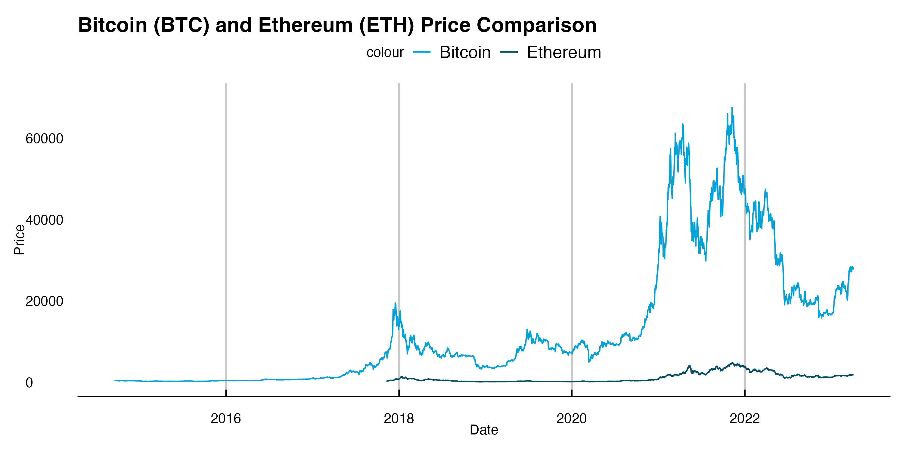
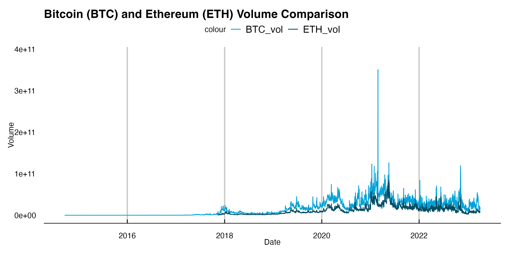
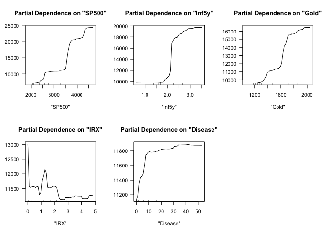
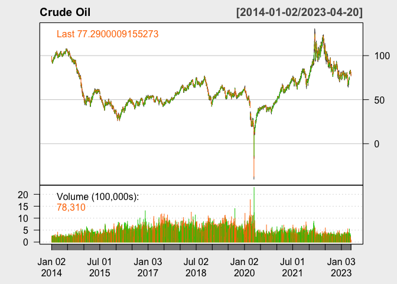
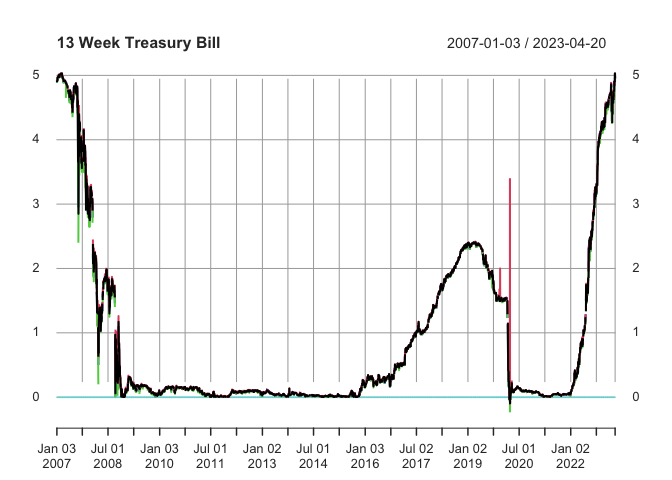
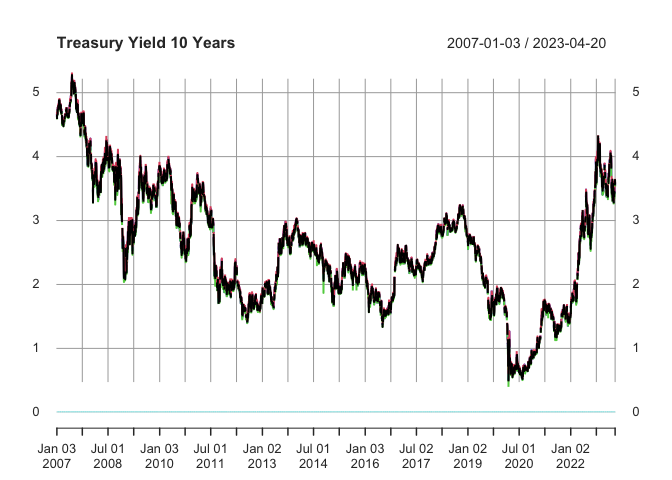
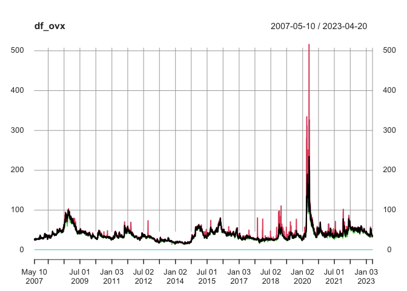

# Abstract

This paper is a study of which factors have a large impact on
cryptocurrencies. Bitcoin and Ethereum were chosen as representative
cryptocurrencies for our research, as these are two of the most popular
and widely used with a significant market capitalization and user base.
This study utilizes a random forest model to analyze the relationship
between predictor variables and an outcome variable. Variable importance
plots are used to identify the most significant predictor variables, and
(meaningful conclusions) are drawn from the analysis.

# Introduction

Bitcoin, a type of digital currency run on blockchain technology, has
recently gained traction as a potential currency to substitute for fiat
money such as the U.S. dollar. A massive ‘money-printing’ by the Federal
Reserve in response to the 2008 financial crisis and the Covid crisis
has raised concerns about the strength and sustainability of the dollar
value. Since then, market participants have been increasingly treating
Bitcoin as a hedging asset. Devoid of the intrinsic value, however,
Bitcoin has experienced a massive fluctuation in terms of asset prices.
Specifically, at the onset of the Covid crisis in March 2020, the
Bitcoin price dipped as low as `$5,165`. It grew more than tenfold to
`$61,283` per Bitcoin in exactly one year, and hit as high as `$64,400`
before crashing back down to hovering around `$25,000` in the beginning
of the year 2023. Therefore, investors have taken interest in predicting
the short-term Bitcoin price. → (too many have pp’s)

This report answers 3 questions. First, we attempt to test a variety of
models and find a model that best predicts the Bitcoin price direction.
We intend to look at the time horizons of 5-day, 10-day, and 20-day,
representing 1 week, 2 weeks, and 4 weeks excluding weekends,
respectively. Note that our report focuses on predicting the Bitcoin
price direction, rather than the magnitude of the price. Predicting the
size of the prices requires an exorbitant amount of computing power, and
models often perform poorly. In other words, it is not cost-effective,
nor efficient. We will show how accurate our model performs by comparing
our model prediction and the realized price direction.

Second, after identifying the best-predicting model, we attempt to find
a variable that contributes the most to the price direction prediction.
Next, we plan to run the model not only on Bitcoin but also on two other
popular coins in terms of trading volumes, Ethereum, and Ripple, using
common features. In doing so, we are able to find if these coins are
‘substitutes’ or ‘complements’ to one another. This finding can help
investors make well-informed investment decisions; they may be able to
diversify their digital asset portfolios in response to technical or
macroeconomic shocks using our model.

# Methods

## Data:

After reading a few existing studies regarding price prediction of an
investment asset, we have learned that a wide spectrum of macroeconomic
and market performance factors, such as inflation, interest rates, and
market volatility are incorporated in building price predicting models.
In addition to these common factors, we have also added some other
variables we deemed important in terms of predictive power. Our data set
consists of relevant daily asset prices, macroeconomic and market
performance indicators, which are mainly collected from Yahoo Finance
and Federal Reserve Economic Data (FRED).

First, we have daily prices of Bitcoin (BTC), Ethereum (ETH), oil, and
gold. Inflation is measured by two proxies, yield on 10-year Treasury
note (TNX) and 13 Week Treasury Bill (IRX). CBOE volatility index (VIX)
estimates equity market volatility, while CBOE crude oil volatility
index (OVX) measures oil market uncertainty. SP500, which tracks the top
500 U.S. stocks, is used to compute the US stock market performance. All
of these data were collected from Yahoo Finance.

In addition to aforementioned inflation proxies, 5-Year breakeven
inflation rate (inf5y), which implies market participants’ inflation
expectation for the next five years, was also added. Equity Market
Volatility: Infectious Disease Tracker (DISEASE) was included to account
for the economic impact of COVID-19. U.S. dollar index (DXY) measures
the performance of dollar against a basket of other world currencies.
Policy-related uncertainty is measured by Economic Policy Uncertainty
Index (EPU), and stock market uncertainty is measured by Equity Market
Uncertainty Index (EMU). All of these data were collected from FRED.

Lastly, we added Credit Default Swap (CDS), which basically is a
financial derivative through which a seller can swap his credit risk
with that of a buyer. As this indicator measures dwindling of
centralized financial markets, we thought it would be interesting to see
its relationship with the price action of cryptocurrencies, a
decentralized asset class. This data was separately collected from
Investing.com.

## Methodology:

In predicting Bitcoin price direction, we compare three main models:
Classification and Regression Trees (CART), Random Forest and Gradient
Boosting. To briefly recap what we learned in class, tree is a simple
predictive model that is widely used in machine learning. CART, also
called “recursive partitioning”, is a basic tree-fitting algorithm.
Basically, we grow the tree recursively as to make deviance as small as
possible. When we reach our minimum size or complexity stopping points,
we will stop growing and prune back to make candidate trees. Lastly, we
will choose via cross validation (min or 1SE).

Random forest is perhaps the most popular generic nonparametric
regression technique as the model not only requires little to no cross
validation and is also fast and effective. Here, we will fit trees to
number of bootstrapped samples of the original data. This process, also
called bagging, usually produces a better fit with lower variance than a
single tree. It adds more randomness as we ‘randomly’ choose features
subsets in building a tree, hence the name ‘random forest.’ After
fitting a tree to each bootstrapped sample, we will average the
predictions of all the different trees, producing an aggregated result,
which should be more accurate.

Gradient boosting is an ensemble method like random forests. However,
here you recursively fit simple trees to its ‘residuals’. That is, while
random forests fits trees simultaneously, gradient boosting builds one
tree at a time. This model adds the newly crushed tree into the fit in
each stage along the way and so the final fit is the sum of many trees.
Gradient boosting can work better than random forests with finely-tuned
parameters. However, it is more sensitive to noise, thus more easily
encounters over-fitting problems.

# Results

<table class=" lightable-classic-2" style="font-family: &quot;Arial Narrow&quot;, &quot;Source Sans Pro&quot;, sans-serif; width: auto !important; margin-left: auto; margin-right: auto;">
<caption>
Summary Statistics
</caption>
<thead>
<tr>
<th style="text-align:left;">
Variable
</th>
<th style="text-align:left;">
N
</th>
<th style="text-align:left;">
Mean
</th>
<th style="text-align:left;">
Std. Dev.
</th>
<th style="text-align:left;">
Min
</th>
<th style="text-align:left;">
Pctl. 25
</th>
<th style="text-align:left;">
Pctl. 75
</th>
<th style="text-align:left;">
Max
</th>
</tr>
</thead>
<tbody>
<tr>
<td style="text-align:left;">
DXY
</td>
<td style="text-align:left;">
2304
</td>
<td style="text-align:left;">
112
</td>
<td style="text-align:left;">
7.3
</td>
<td style="text-align:left;">
93
</td>
<td style="text-align:left;">
110
</td>
<td style="text-align:left;">
116
</td>
<td style="text-align:left;">
128
</td>
</tr>
<tr>
<td style="text-align:left;">
CDS
</td>
<td style="text-align:left;">
1969
</td>
<td style="text-align:left;">
11
</td>
<td style="text-align:left;">
12
</td>
<td style="text-align:left;">
2
</td>
<td style="text-align:left;">
5.5
</td>
<td style="text-align:left;">
12
</td>
<td style="text-align:left;">
86
</td>
</tr>
<tr>
<td style="text-align:left;">
EMU
</td>
<td style="text-align:left;">
3381
</td>
<td style="text-align:left;">
70
</td>
<td style="text-align:left;">
94
</td>
<td style="text-align:left;">
4.8
</td>
<td style="text-align:left;">
13
</td>
<td style="text-align:left;">
91
</td>
<td style="text-align:left;">
1230
</td>
</tr>
<tr>
<td style="text-align:left;">
EPU
</td>
<td style="text-align:left;">
3381
</td>
<td style="text-align:left;">
123
</td>
<td style="text-align:left;">
98
</td>
<td style="text-align:left;">
3.3
</td>
<td style="text-align:left;">
64
</td>
<td style="text-align:left;">
144
</td>
<td style="text-align:left;">
861
</td>
</tr>
<tr>
<td style="text-align:left;">
Inf5y
</td>
<td style="text-align:left;">
2315
</td>
<td style="text-align:left;">
1.8
</td>
<td style="text-align:left;">
0.54
</td>
<td style="text-align:left;">
0.14
</td>
<td style="text-align:left;">
1.5
</td>
<td style="text-align:left;">
2.1
</td>
<td style="text-align:left;">
3.6
</td>
</tr>
<tr>
<td style="text-align:left;">
Disease
</td>
<td style="text-align:left;">
3380
</td>
<td style="text-align:left;">
5.8
</td>
<td style="text-align:left;">
10
</td>
<td style="text-align:left;">
0
</td>
<td style="text-align:left;">
0
</td>
<td style="text-align:left;">
8.4
</td>
<td style="text-align:left;">
113
</td>
</tr>
<tr>
<td style="text-align:left;">
Oil
</td>
<td style="text-align:left;">
2332
</td>
<td style="text-align:left;">
63
</td>
<td style="text-align:left;">
21
</td>
<td style="text-align:left;">
-38
</td>
<td style="text-align:left;">
48
</td>
<td style="text-align:left;">
74
</td>
<td style="text-align:left;">
124
</td>
</tr>
<tr>
<td style="text-align:left;">
Gold
</td>
<td style="text-align:left;">
2330
</td>
<td style="text-align:left;">
1454
</td>
<td style="text-align:left;">
273
</td>
<td style="text-align:left;">
1051
</td>
<td style="text-align:left;">
1240
</td>
<td style="text-align:left;">
1753
</td>
<td style="text-align:left;">
2052
</td>
</tr>
<tr>
<td style="text-align:left;">
Bitcoin
</td>
<td style="text-align:left;">
3123
</td>
<td style="text-align:left;">
13175
</td>
<td style="text-align:left;">
16045
</td>
<td style="text-align:left;">
178
</td>
<td style="text-align:left;">
715
</td>
<td style="text-align:left;">
19048
</td>
<td style="text-align:left;">
67567
</td>
</tr>
<tr>
<td style="text-align:left;">
Ethereum
</td>
<td style="text-align:left;">
1974
</td>
<td style="text-align:left;">
1153
</td>
<td style="text-align:left;">
1164
</td>
<td style="text-align:left;">
84
</td>
<td style="text-align:left;">
217
</td>
<td style="text-align:left;">
1744
</td>
<td style="text-align:left;">
4812
</td>
</tr>
<tr>
<td style="text-align:left;">
IRX
</td>
<td style="text-align:left;">
2329
</td>
<td style="text-align:left;">
0.95
</td>
<td style="text-align:left;">
1.2
</td>
<td style="text-align:left;">
-0.1
</td>
<td style="text-align:left;">
0.043
</td>
<td style="text-align:left;">
1.7
</td>
<td style="text-align:left;">
4.9
</td>
</tr>
<tr>
<td style="text-align:left;">
TNX
</td>
<td style="text-align:left;">
2329
</td>
<td style="text-align:left;">
2.2
</td>
<td style="text-align:left;">
0.75
</td>
<td style="text-align:left;">
0.5
</td>
<td style="text-align:left;">
1.7
</td>
<td style="text-align:left;">
2.7
</td>
<td style="text-align:left;">
4.2
</td>
</tr>
<tr>
<td style="text-align:left;">
VIX
</td>
<td style="text-align:left;">
2331
</td>
<td style="text-align:left;">
18
</td>
<td style="text-align:left;">
7.5
</td>
<td style="text-align:left;">
9.1
</td>
<td style="text-align:left;">
13
</td>
<td style="text-align:left;">
22
</td>
<td style="text-align:left;">
83
</td>
</tr>
<tr>
<td style="text-align:left;">
OVX
</td>
<td style="text-align:left;">
2331
</td>
<td style="text-align:left;">
40
</td>
<td style="text-align:left;">
20
</td>
<td style="text-align:left;">
14
</td>
<td style="text-align:left;">
29
</td>
<td style="text-align:left;">
46
</td>
<td style="text-align:left;">
325
</td>
</tr>
<tr>
<td style="text-align:left;">
SP500
</td>
<td style="text-align:left;">
2331
</td>
<td style="text-align:left;">
2897
</td>
<td style="text-align:left;">
844
</td>
<td style="text-align:left;">
1742
</td>
<td style="text-align:left;">
2105
</td>
<td style="text-align:left;">
3644
</td>
<td style="text-align:left;">
4797
</td>
</tr>
<tr>
<td style="text-align:left;">
Month
</td>
<td style="text-align:left;">
3384
</td>
<td style="text-align:left;">
6.4
</td>
<td style="text-align:left;">
3.5
</td>
<td style="text-align:left;">
1
</td>
<td style="text-align:left;">
3
</td>
<td style="text-align:left;">
9
</td>
<td style="text-align:left;">
12
</td>
</tr>
</tbody>
</table>

## Bitcoin

    ## [1] 1723

### Random Forest

<table class=" lightable-classic-2" style="font-family: &quot;Arial Narrow&quot;, &quot;Source Sans Pro&quot;, sans-serif; width: auto !important; margin-left: auto; margin-right: auto;">
<caption>
Model performance with out-of-sample RMSEs (Bitcoin)
</caption>
<thead>
<tr>
<th style="text-align:left;">
Model
</th>
<th style="text-align:right;">
RMSE
</th>
</tr>
</thead>
<tbody>
<tr>
<td style="text-align:left;">
CART
</td>
<td style="text-align:right;">
2401.052
</td>
</tr>
<tr>
<td style="text-align:left;">
Random Forest
</td>
<td style="text-align:right;">
1042.764
</td>
</tr>
<tr>
<td style="text-align:left;">
Gradient Boosting
</td>
<td style="text-align:right;">
1241.433
</td>
</tr>
</tbody>
</table>
## Ethereum

    ## [1] 1023

### Random Forest

<table class=" lightable-classic-2" style="font-family: &quot;Arial Narrow&quot;, &quot;Source Sans Pro&quot;, sans-serif; width: auto !important; margin-left: auto; margin-right: auto;">
<caption>
Model performance with out-of-sample RMSEs (Ethereum)
</caption>
<thead>
<tr>
<th style="text-align:left;">
Model
</th>
<th style="text-align:right;">
RMSE
</th>
</tr>
</thead>
<tbody>
<tr>
<td style="text-align:left;">
CART
</td>
<td style="text-align:right;">
2401.052
</td>
</tr>
<tr>
<td style="text-align:left;">
Random Forest
</td>
<td style="text-align:right;">
1042.764
</td>
</tr>
<tr>
<td style="text-align:left;">
Gradient Boosting
</td>
<td style="text-align:right;">
1241.433
</td>
</tr>
</tbody>
</table>
# Conclusion

# Appendix

