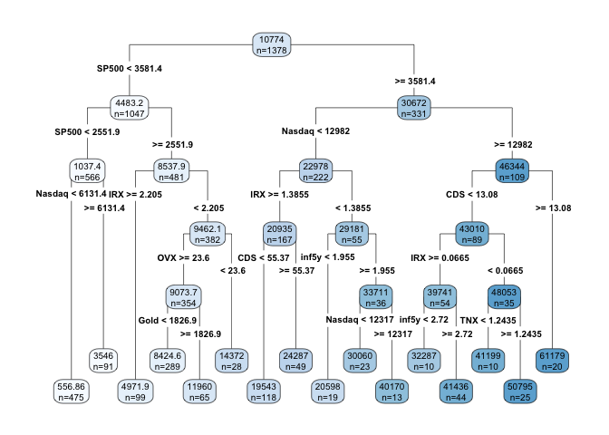
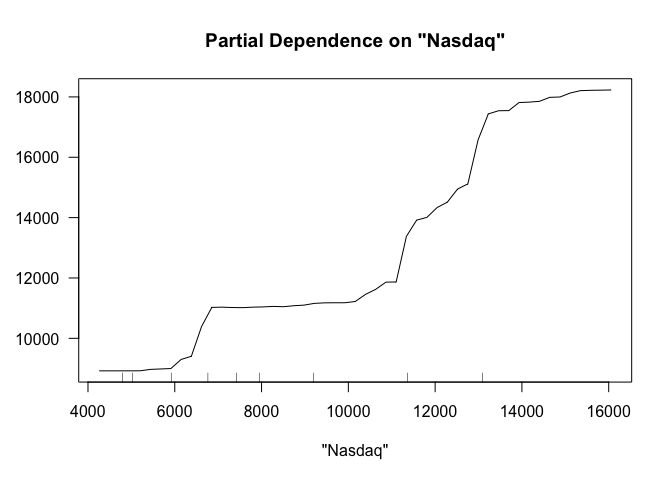
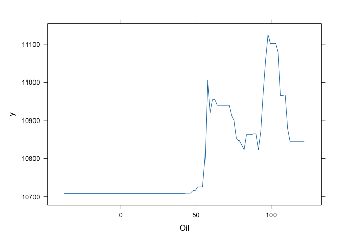
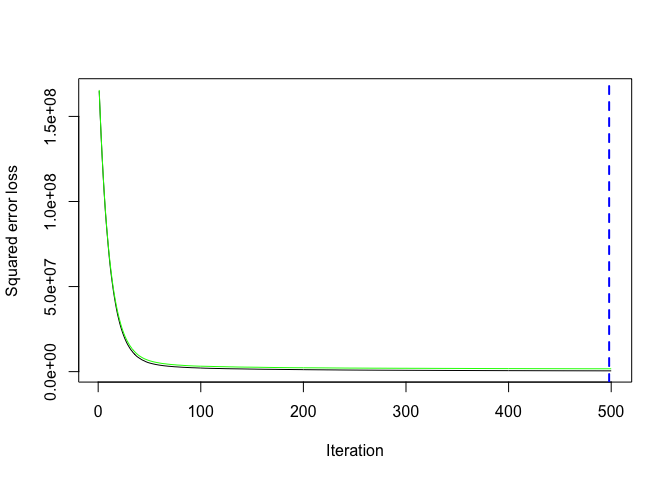
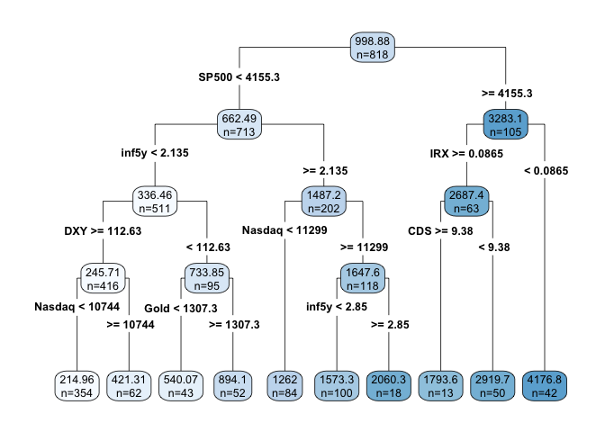
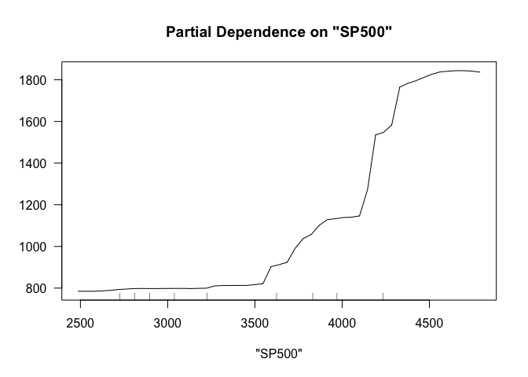
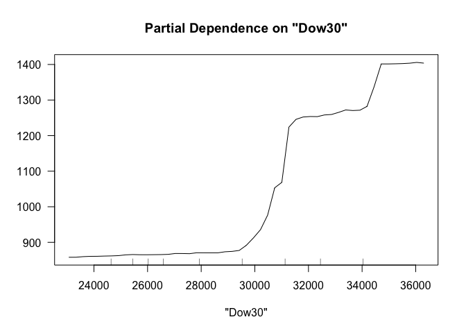
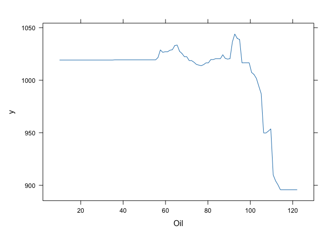
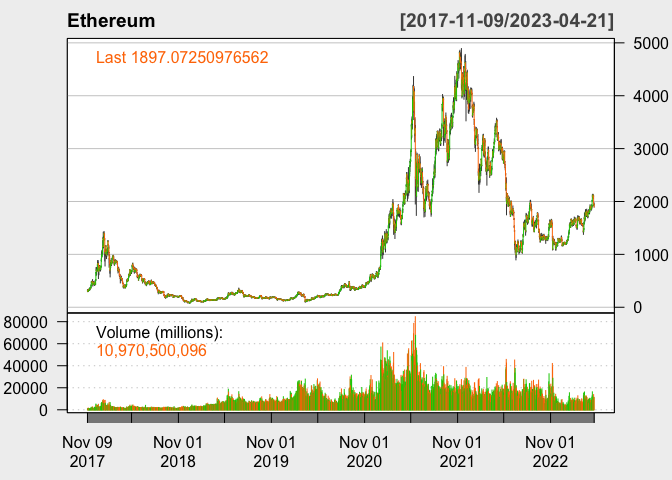

# Abstract

# Introduction

Bitcoin, a type of digital currency run on blockchain technology, has
recently gained traction as a potential currency to substitute for fiat
money such as the U.S. dollar. A massive ‘money-printing’ by the Federal
Reserve in response to the 2008 financial crisis and the Covid crisis
has raised concerns about the strength and sustainability of the dollar
value. Since then, market participants have been increasingly treating
Bitcoin as a hedging asset. Devoid of the intrinsic value, however,
Bitcoin has experienced a massive fluctuation in terms of asset prices.
Specifically, at the onset of the Covid crisis in March 2020, the
Bitcoin price dipped as low as `$5,165`. It grew more than tenfold to
`$61,283` per Bitcoin in exactly one year, and hit as high as `$64,400`
before crashing back down to hovering around `$25,000` in the beginning
of the year 2023. Therefore, investors have taken interest in predicting
the short-term Bitcoin price. → (too many have pp’s)

This report answers 3 questions. First, we attempt to test a variety of
models and find a model that best predicts the Bitcoin price direction.
We intend to look at the time horizons of 5-day, 10-day, and 20-day,
representing 1 week, 2 weeks, and 4 weeks excluding weekends,
respectively. Note that our report focuses on predicting the Bitcoin
price direction, rather than the magnitude of the price. Predicting the
size of the prices requires an exorbitant amount of computing power, and
models often perform poorly. In other words, it is not cost-effective,
nor efficient. We will show how accurate our model performs by comparing
our model prediction and the realized price direction.

Second, after identifying the best-predicting model, we attempt to find
a variable that contributes the most to the price direction prediction.
Next, we plan to run the model not only on Bitcoin but also on two other
popular coins in terms of trading volumes, Ethereum, and Ripple, using
common features. In doing so, we are able to find if these coins are
‘substitutes’ or ‘complements’ to one another. This finding can help
investors make well-informed investment decisions; they may be able to
diversify their digital asset portfolios in response to technical or
macroeconomic shocks using our model.

# Methods

Data:

Methodology:

In predicting Bitcoin price direction, we compare three main models:
Classification and Regression Trees (CART), Random Forest and Gradient
Boosting. To briefly recap what we learned in class, tree is a simple
predictive model that is widely used in machine learning. CART, also
called “recursive partitioning”, is a basic tree-fitting algorithm.
Basically, we grow the tree recursively as to make deviance as small as
possible. When we reach our minimum size or complexity stopping points,
we will stop growing and prune back to make candidate trees. Lastly, we
will choose via cross validation (min or 1SE).

Random forest is perhaps the most popular generic nonparametric
regression technique as the model not only requires little to no cross
validation and is also fast and effective. Here, we will fit trees to
number of bootstrapped samples of the original data. This process, also
called bagging, usually produces a better fit with lower variance than a
single tree. It adds more randomness as we ‘randomly’ choose features
subsets in building a tree, hence the name ‘random forest.’ After
fitting a tree to each bootstrapped sample, we will average the
predictions of all the different trees, producing an aggregated result,
which should be more accurate.

Gradient boosting is an ensemble method like random forests. However,
here you recursively fit simple trees to its ‘residuals’. That is, while
random forests fits trees simultaneously, gradient boosting builds one
tree at a time. This model adds the newly crushed tree into the fit in
each stage along the way and so the final fit is the sum of many trees.
Gradient boosting can work better than random forests with finely-tuned
parameters. However, it is more sensitive to noise, thus more easily
encounters over-fitting problems.

# Results

## Bitcoin

### Classification and Regression Trees (CART)

    ## [1] 1723

    ## [1] 2402.217

### Random Forest

    ## [1] 915.735

### Gradient Boosting

    ## [1] 500

    ## [1] 1146.371

<table>
<thead>
<tr>
<th style="text-align:left;">
Model
</th>
<th style="text-align:right;">
RMSE
</th>
</tr>
</thead>
<tbody>
<tr>
<td style="text-align:left;">
CART
</td>
<td style="text-align:right;">
2402.217
</td>
</tr>
<tr>
<td style="text-align:left;">
Random Forest
</td>
<td style="text-align:right;">
915.735
</td>
</tr>
<tr>
<td style="text-align:left;">
Gradient Boosting
</td>
<td style="text-align:right;">
1146.371
</td>
</tr>
</tbody>
</table>
## Ethereum

### Classification and Regression Trees (CART)

    ## [1] 1023

    ## [1] 243.3626

### Random Forest

    ## [1] 91.88629

### Gradient Boosting

    ## [1] 484

    ## [1] 107.9797

<table>
<thead>
<tr>
<th style="text-align:left;">
Model
</th>
<th style="text-align:right;">
RMSE
</th>
</tr>
</thead>
<tbody>
<tr>
<td style="text-align:left;">
CART
</td>
<td style="text-align:right;">
243.36258
</td>
</tr>
<tr>
<td style="text-align:left;">
Random Forest
</td>
<td style="text-align:right;">
91.88629
</td>
</tr>
<tr>
<td style="text-align:left;">
Gradient Boosting
</td>
<td style="text-align:right;">
107.97969
</td>
</tr>
</tbody>
</table>
# Conclusion

# Appendix

