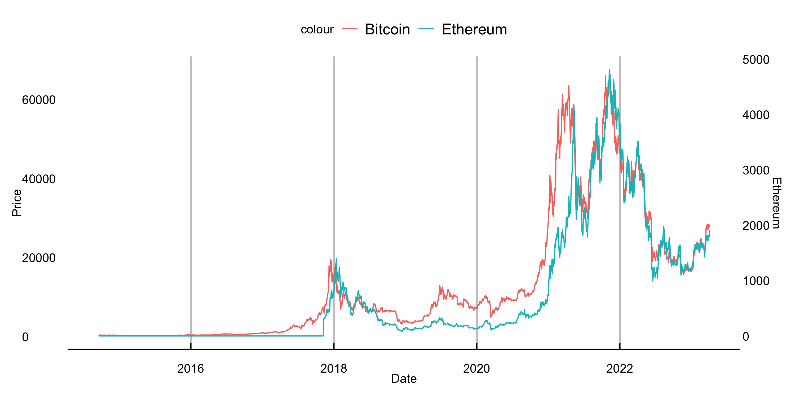
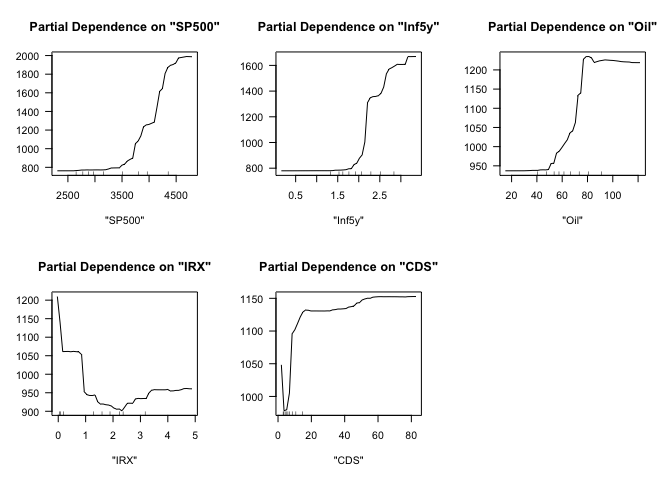
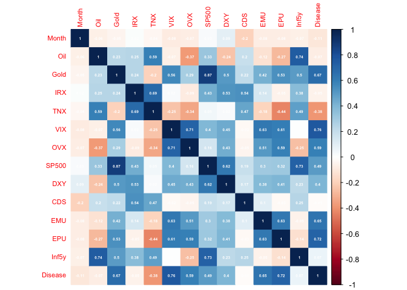
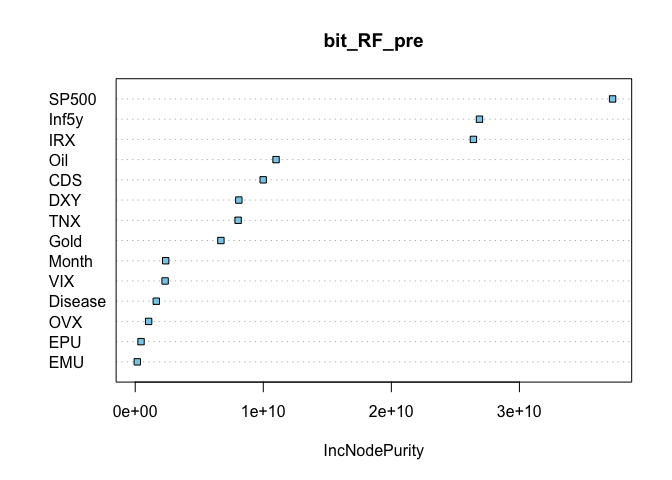
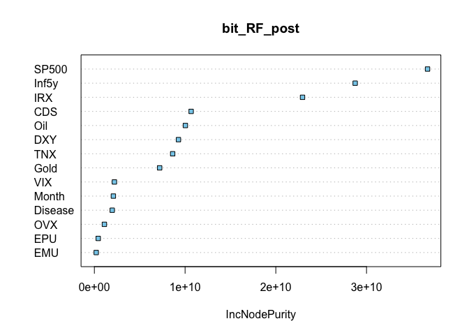
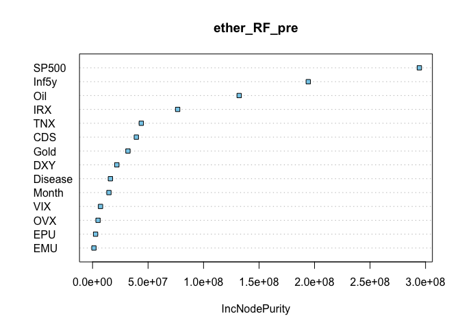
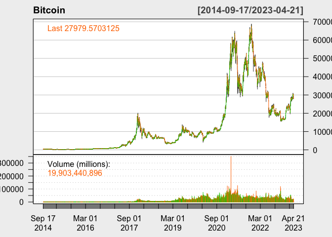
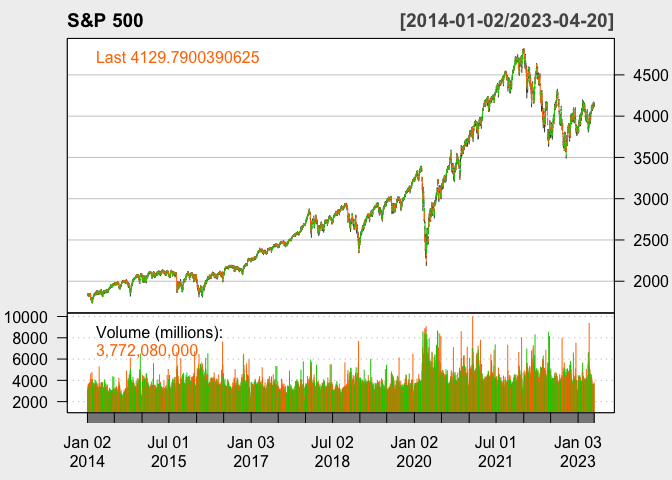
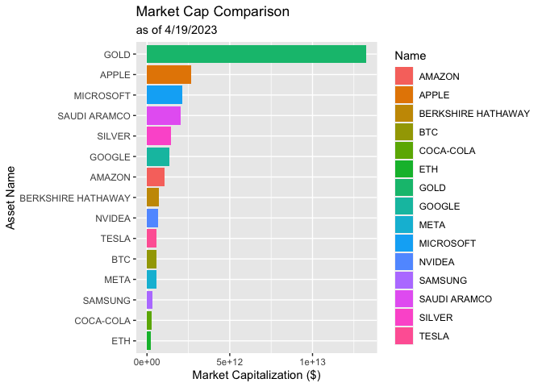

# Abstract

This paper is a study of which factors have a large impact on
cryptocurrencies. Bitcoin and Ethereum were chosen as representative
cryptocurrencies for our research, as these are two of the most popular
and widely used with a significant market capitalization and user base.
This study utilizes a random forest model to analyze the relationship
between predictor variables and an outcome variable. Variable importance
plots are used to identify the most significant predictor variables, and
(meaningful conclusions) are drawn from the analysis.

# Introduction

Bitcoin, a type of digital currency run on blockchain technology, has
recently gained traction as a potential currency to substitute for fiat
money such as the U.S. dollar. A massive ‘money-printing’ by the Federal
Reserve in response to the 2008 financial crisis and the Covid crisis
has raised concerns about the strength and sustainability of the dollar
value. Since then, market participants have been increasingly treating
Bitcoin as a hedging asset. Devoid of the intrinsic value, however,
Bitcoin has experienced a massive fluctuation in terms of asset prices.
Specifically, at the onset of the Covid crisis in March 2020, the
Bitcoin price dipped as low as `$5,165`. It grew more than tenfold to
`$61,283` per Bitcoin in exactly one year, and hit as high as `$64,400`
before crashing back down to hovering around `$25,000` in the beginning
of the year 2023. Therefore, investors have taken interest in predicting
the short-term Bitcoin price. → (too many have pp’s)

This report answers 3 questions. First, we attempt to test a variety of
models and find a model that best predicts the Bitcoin price. We test
the prediction power between CART, Random Forest, and Gradient Boosted
trees model. We will pick the model that gives the lowest value of RMSE.
Second, after identifying the best-predicting model, we attempt to find
a variable that contributes the most to the price prediction. Next, we
will run the model not only on Bitcoin but also on Ethereum, the next
popular cryptocurrency, using common features. In doing so, we are able
to identify which features matter more to each cryptocurrency. This
finding can help investors make well-informed investment decisions; they
may be able to diversify their digital asset portfolios in response to
technical or macroeconomic shocks using our model. Specifically, S&P
500, the market performance index which include the top 500 companies in
terms of market capitalization sizes, contribute to the price changes of
both cryptos the most. However, we find that gold price change affects
Bitcoin price change more, and oil price change affects Ethereum price
change more.

# Methods

## Data:

After reading a few existing studies regarding price prediction of an
investment asset, we have learned that a wide spectrum of macroeconomic
and market performance factors, such as inflation, interest rates, and
market volatility are incorporated in building price predicting models.
In addition to these common factors, we have also added some other
variables we deemed important in terms of predictive power. Our data set
consists of relevant daily asset prices, macroeconomic and market
performance indicators, which are mainly collected from Yahoo Finance
and Federal Reserve Economic Data (FRED).

First, we have daily prices of Bitcoin (BTC), Ethereum (ETH), oil, and
gold. Inflation is measured by two proxies, yield on 10-year Treasury
note (TNX) and 13 Week Treasury Bill (IRX). CBOE volatility index (VIX)
estimates equity market volatility, while CBOE crude oil volatility
index (OVX) measures oil market uncertainty. SP500, which tracks the top
500 U.S. stocks, is used to compute the US stock market performance. All
of these data were collected from Yahoo Finance.

In addition to aforementioned inflation proxies, 5-Year breakeven
inflation rate (inf5y), which implies market participants’ inflation
expectation for the next five years, was also added. Equity Market
Volatility: Infectious Disease Tracker (DISEASE) was included to account
for the economic impact of COVID-19. U.S. dollar index (DXY) measures
the performance of dollar against a basket of other world currencies.
Policy-related uncertainty is measured by Economic Policy Uncertainty
Index (EPU), and stock market uncertainty is measured by Equity Market
Uncertainty Index (EMU). All of these data were collected from FRED.

Lastly, we added Credit Default Swap (CDS), which basically is a
financial derivative through which a seller can swap his credit risk
with that of a buyer. As this indicator measures dwindling of
centralized financial markets, we thought it would be interesting to see
its relationship with the price action of cryptocurrencies, a
decentralized asset class. This data was separately collected from
Investing.com.

## Methodology:

In predicting Bitcoin and Ethereum price, we compare three main models:
Classification and Regression Trees (CART), Random Forest and Gradient
Boosting. To briefly recap what we learned in class, tree is a simple
predictive model that is widely used in machine learning. **CART**, also
called “recursive partitioning”, is a basic tree-fitting algorithm.
Basically, we grow the tree recursively as to make deviance as small as
possible. When we reach our minimum size or complexity stopping points,
we will stop growing and prune back to make candidate trees. Lastly, we
will choose via cross validation (min or 1SE).

**Random forest** is perhaps the most popular generic nonparametric
regression technique as the model not only requires little to no cross
validation and is also fast and effective. Here, we will fit trees to
number of bootstrapped samples of the original data. This process, also
called bagging, usually produces a better fit with lower variance than a
single tree. It adds more randomness as we ‘randomly’ choose features
subsets in building a tree, hence the name ‘random forest.’ After
fitting a tree to each bootstrapped sample, we will average the
predictions of all the different trees, producing an aggregated result,
which should be more accurate.

**Gradient boosting** is an ensemble method like random forests.
However, here you recursively fit simple trees to its ‘residuals’. That
is, while random forests fits trees simultaneously, gradient boosting
builds one tree at a time. This model adds the newly crushed tree into
the fit in each stage along the way and so the final fit is the sum of
many trees. Gradient boosting can work better than random forests with
finely-tuned parameters. However, it is more sensitive to noise, thus
more easily encounters over-fitting problems.

Our random forests give us **variable importance plots**, which provide
a list of the most significant variables in descending order. Using
these plots, we can gain some useful insight into which variables
contribute the most to our model. We compare the results for Bitcoin and
Ethereum.

After our model has been fit, we calculate **partial dependence plots**.
These plots visualize the relationship between price and the five most
significant variables from the variable importance plots, taking account
of the joint effect of other features.

# Results

## Bitcoin

We used CART, Random Forest, and Gradient Boosted trees model and
compared out-of-sample RMSEs, and we could check that the Random Forest
is the best performance on the testing data. `Bitcoin` is the target
variable, and the rest of the variables, excluding the `DATE` variable,
are used as predictors. We used the randomForest function to fit a model
and used the VarImpPlot function to display the variables which highly
contribute to the model.

### Random Forest

We could check `SP500`,`Inf5y`,`Gold`,`IRX`,`Disease` are top 5
important variables for bitcoin.

Below is the partial dependence plots to isolate the partial effect of
specific features on the outcome. Partial dependence plot is a method
used to analyze the relationship between the target variable (dependent
variable) and a specific predictor variable while holding all other
predictors constant.

All variables, except for `IRX`, shows an increasing dependence plot. We
can interpret `SP500`, `Inf5y`,`Gold`,`Disease` features have a positive
effect on predicted outcome, and `IRX` has a negative effect on
predicted outcome.

<table class=" lightable-minimal table" style="font-family: &quot;Trebuchet MS&quot;, verdana, sans-serif; margin-left: auto; margin-right: auto; width: auto !important; ">
<caption>
Model performance with out-of-sample RMSEs (Bitcoin)
</caption>
<thead>
<tr>
<th style="text-align:left;">
Model
</th>
<th style="text-align:right;">
RMSE
</th>
</tr>
</thead>
<tbody>
<tr>
<td style="text-align:left;">
CART
</td>
<td style="text-align:right;">
1963.7602
</td>
</tr>
<tr>
<td style="text-align:left;">
Random Forest
</td>
<td style="text-align:right;">
904.0348
</td>
</tr>
<tr>
<td style="text-align:left;">
Gradient Boosting
</td>
<td style="text-align:right;">
1183.6454
</td>
</tr>
</tbody>
</table>

## Ethereum

Same as Bitcoin, to predict Ethereum, we used CART, Random Forest, and
Gradient Boosted trees model and compared out-of-sample RMSEs, and we
could check that the Random Forest is the best performance on the
testing data. `Ethereum` is the target variable, and the rest of the
variables, excluding the `DATE` variable, are used as predictors. We
used the randomForest function to fit a model and used the VarImpPlot
function to display the variables which highly contribute to the model.

### Random Forest

We could check `SP500`,`Inf5y`,`Oil`,`IRX`,`CDS` are top 5 important
variables for ethereum. `SP500` and `Inf5y` seem to have the highest
importance in both bitcoin and ethereum, but it is an interesting result
that there is a difference that gold has a great influence on bitcoin
and oil has a great influence on ethereum. Below is the partial
dependence plots to isolate the partial effect of specific features on
the outcome.

All variables, except for `IRX`, shows an increasing dependence plot. We
can interpret `SP500`, `Inf5y`,`Gold`,`Disease` features have a positive
effect on predicted outcome, and `IRX` has a negative effect on
predicted outcome.

<table class=" lightable-minimal table" style="font-family: &quot;Trebuchet MS&quot;, verdana, sans-serif; margin-left: auto; margin-right: auto; width: auto !important; ">
<caption>
Model performance with out-of-sample RMSEs (Ethereum)
</caption>
<thead>
<tr>
<th style="text-align:left;">
Model
</th>
<th style="text-align:right;">
RMSE
</th>
</tr>
</thead>
<tbody>
<tr>
<td style="text-align:left;">
CART
</td>
<td style="text-align:right;">
1963.7602
</td>
</tr>
<tr>
<td style="text-align:left;">
Random Forest
</td>
<td style="text-align:right;">
904.0348
</td>
</tr>
<tr>
<td style="text-align:left;">
Gradient Boosting
</td>
<td style="text-align:right;">
1183.6454
</td>
</tr>
</tbody>
</table>

### Correlation Plots

For a deeper understanding of our paper, we will analyze the
relationship with a correlation plot between predictors, which are
macroeconomic and market performance factors. We know that correlation
plot only measures the strength and direction of linear relationships
between variables, but see correlation between predictors may provide
some insights.

Below is the correlation plot for every factors we added, you can check
there’s some stronger correlations, represented with darker colors.

We decided to investigate the strong correlations with coefficients
above 0.60.

<table class=" lightable-minimal" style="font-family: &quot;Trebuchet MS&quot;, verdana, sans-serif; margin-left: auto; margin-right: auto;">
<caption>
Highest correlation among factors
</caption>
<thead>
<tr>
<th style="text-align:left;">
Var1
</th>
<th style="text-align:left;">
Var2
</th>
<th style="text-align:right;">
Freq
</th>
</tr>
</thead>
<tbody>
<tr>
<td style="text-align:left;">
Gold
</td>
<td style="text-align:left;">
SP500
</td>
<td style="text-align:right;">
0.8705935
</td>
</tr>
<tr>
<td style="text-align:left;">
VIX
</td>
<td style="text-align:left;">
Disease
</td>
<td style="text-align:right;">
0.7636956
</td>
</tr>
<tr>
<td style="text-align:left;">
Oil
</td>
<td style="text-align:left;">
Inf5y
</td>
<td style="text-align:right;">
0.7431183
</td>
</tr>
<tr>
<td style="text-align:left;">
SP500
</td>
<td style="text-align:left;">
Inf5y
</td>
<td style="text-align:right;">
0.7262370
</td>
</tr>
<tr>
<td style="text-align:left;">
EPU
</td>
<td style="text-align:left;">
Disease
</td>
<td style="text-align:right;">
0.7172680
</td>
</tr>
<tr>
<td style="text-align:left;">
VIX
</td>
<td style="text-align:left;">
OVX
</td>
<td style="text-align:right;">
0.7117934
</td>
</tr>
<tr>
<td style="text-align:left;">
IRX
</td>
<td style="text-align:left;">
TNX
</td>
<td style="text-align:right;">
0.6896120
</td>
</tr>
<tr>
<td style="text-align:left;">
Gold
</td>
<td style="text-align:left;">
Disease
</td>
<td style="text-align:right;">
0.6705888
</td>
</tr>
<tr>
<td style="text-align:left;">
EMU
</td>
<td style="text-align:left;">
Disease
</td>
<td style="text-align:right;">
0.6457534
</td>
</tr>
<tr>
<td style="text-align:left;">
VIX
</td>
<td style="text-align:left;">
EMU
</td>
<td style="text-align:right;">
0.6273703
</td>
</tr>
<tr>
<td style="text-align:left;">
EMU
</td>
<td style="text-align:left;">
EPU
</td>
<td style="text-align:right;">
0.6270346
</td>
</tr>
<tr>
<td style="text-align:left;">
SP500
</td>
<td style="text-align:left;">
DXY
</td>
<td style="text-align:right;">
0.6234803
</td>
</tr>
<tr>
<td style="text-align:left;">
VIX
</td>
<td style="text-align:left;">
EPU
</td>
<td style="text-align:right;">
0.6056454
</td>
</tr>
</tbody>
</table>

Result shows `Gold` and `SP500` shows pretty strong correlation, 0.87.
The next highest correlation is `VIX` and `Disease`.

(I think we should find some meaningful correlation here for our
analysis)

## K-means clustering

We did supervised learning method, Random Forest. Now we will try an
unsupervised learning, K-means clustering method, which can be used to
identify clusters of similar factors. First, will start from choosing
optimal K, the amount of clusters. Below is Elbow plot. Elbow plot used
to determine the optimal number of clustering. The plot displays
within-cluster sum of squares(WSS) as a function of the number of
clusters.

Will use 6 for k, the number of clusters.

<table class="kable_wrapper lightable-minimal table" style="font-family: &quot;Trebuchet MS&quot;, verdana, sans-serif; margin-left: auto; margin-right: auto; width: auto !important; ">
<tbody>
<tr>
<td>
<table>
<thead>
<tr>
<th style="text-align:left;">
</th>
<th style="text-align:right;">
cluster1
</th>
</tr>
</thead>
<tbody>
<tr>
<td style="text-align:left;">
SP500
</td>
<td style="text-align:right;">
1926.08094
</td>
</tr>
<tr>
<td style="text-align:left;">
Gold
</td>
<td style="text-align:right;">
1268.64375
</td>
</tr>
<tr>
<td style="text-align:left;">
DXY
</td>
<td style="text-align:right;">
95.39114
</td>
</tr>
<tr>
<td style="text-align:left;">
Oil
</td>
<td style="text-align:right;">
94.16828
</td>
</tr>
<tr>
<td style="text-align:left;">
EPU
</td>
<td style="text-align:right;">
66.23844
</td>
</tr>
</tbody>
</table>
</td>
<td>
<table>
<thead>
<tr>
<th style="text-align:left;">
</th>
<th style="text-align:right;">
cluster2
</th>
</tr>
</thead>
<tbody>
<tr>
<td style="text-align:left;">
SP500
</td>
<td style="text-align:right;">
2454.34404
</td>
</tr>
<tr>
<td style="text-align:left;">
Gold
</td>
<td style="text-align:right;">
1263.72872
</td>
</tr>
<tr>
<td style="text-align:left;">
DXY
</td>
<td style="text-align:right;">
112.45689
</td>
</tr>
<tr>
<td style="text-align:left;">
EPU
</td>
<td style="text-align:right;">
84.70150
</td>
</tr>
<tr>
<td style="text-align:left;">
Oil
</td>
<td style="text-align:right;">
52.93657
</td>
</tr>
</tbody>
</table>
</td>
<td>
<table>
<thead>
<tr>
<th style="text-align:left;">
</th>
<th style="text-align:right;">
cluster3
</th>
</tr>
</thead>
<tbody>
<tr>
<td style="text-align:left;">
SP500
</td>
<td style="text-align:right;">
3425.7795
</td>
</tr>
<tr>
<td style="text-align:left;">
Gold
</td>
<td style="text-align:right;">
1830.5749
</td>
</tr>
<tr>
<td style="text-align:left;">
EPU
</td>
<td style="text-align:right;">
253.4530
</td>
</tr>
<tr>
<td style="text-align:left;">
EMU
</td>
<td style="text-align:right;">
135.4127
</td>
</tr>
<tr>
<td style="text-align:left;">
DXY
</td>
<td style="text-align:right;">
115.6980
</td>
</tr>
</tbody>
</table>
</td>
<td>
<table>
<thead>
<tr>
<th style="text-align:left;">
</th>
<th style="text-align:right;">
cluster4
</th>
</tr>
</thead>
<tbody>
<tr>
<td style="text-align:left;">
SP500
</td>
<td style="text-align:right;">
4016.2158
</td>
</tr>
<tr>
<td style="text-align:left;">
Gold
</td>
<td style="text-align:right;">
1897.4271
</td>
</tr>
<tr>
<td style="text-align:left;">
EMU
</td>
<td style="text-align:right;">
158.2080
</td>
</tr>
<tr>
<td style="text-align:left;">
EPU
</td>
<td style="text-align:right;">
153.9675
</td>
</tr>
<tr>
<td style="text-align:left;">
DXY
</td>
<td style="text-align:right;">
120.2058
</td>
</tr>
</tbody>
</table>
</td>
<td>
<table>
<thead>
<tr>
<th style="text-align:left;">
</th>
<th style="text-align:right;">
cluster5
</th>
</tr>
</thead>
<tbody>
<tr>
<td style="text-align:left;">
SP500
</td>
<td style="text-align:right;">
2716.0546
</td>
</tr>
<tr>
<td style="text-align:left;">
Gold
</td>
<td style="text-align:right;">
1658.1686
</td>
</tr>
<tr>
<td style="text-align:left;">
EPU
</td>
<td style="text-align:right;">
489.8274
</td>
</tr>
<tr>
<td style="text-align:left;">
EMU
</td>
<td style="text-align:right;">
364.0126
</td>
</tr>
<tr>
<td style="text-align:left;">
OVX
</td>
<td style="text-align:right;">
148.6829
</td>
</tr>
</tbody>
</table>
</td>
<td>
<table>
<thead>
<tr>
<th style="text-align:left;">
</th>
<th style="text-align:right;">
cluster6
</th>
</tr>
</thead>
<tbody>
<tr>
<td style="text-align:left;">
SP500
</td>
<td style="text-align:right;">
4165.98043
</td>
</tr>
<tr>
<td style="text-align:left;">
Gold
</td>
<td style="text-align:right;">
1790.95124
</td>
</tr>
<tr>
<td style="text-align:left;">
EPU
</td>
<td style="text-align:right;">
126.51989
</td>
</tr>
<tr>
<td style="text-align:left;">
DXY
</td>
<td style="text-align:right;">
120.01837
</td>
</tr>
<tr>
<td style="text-align:left;">
EMU
</td>
<td style="text-align:right;">
97.30648
</td>
</tr>
</tbody>
</table>
</td>
</tr>
</tbody>
</table>

## Comparison for Pre-2019 and Post-2019

# Conclusion

# Appendix

